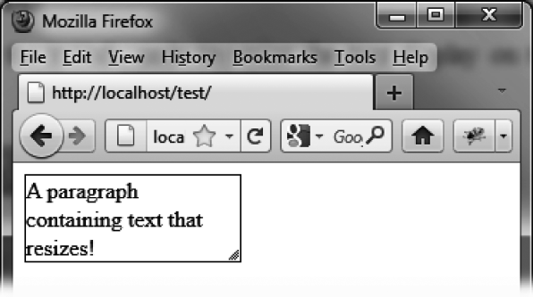

### 13.1　缩放的基本用法

假设我们现在想写一段HTML代码来缩放屏幕上显示的文字，就像图13-1中所示的那样。


<center class="my_markdown"><b class="my_markdown">图13-1　经过缩放的文字</b></center>

图中有一个包含文本的 `<p>` 元素（并且有一个边框），可以使用鼠标来缩放其尺寸（可以通过拖动右边框或是底边框，也可以使用右下角的缩放图标）。

要使用缩放功能，首先需要创建一个 `<p>` 元素，用来容纳我们想要缩放的元素。所有能显示的元素都是可以被缩放的。另外，我们还需要声明元素的原始宽高（这是IE下必需的，除了已知尺寸的元素，如图片）。

当然也别忘了声明使用jQuery UI的 `resizable ()` 方法来管理 `<p>` 元素，如此一来，其右下角即会出现一个缩放图标。

```css
<script src = jquery.js></script>
<script src = jqueryui/js/jquery-ui-1.8.16.custom.min.js></script>
<link rel=stylesheet type=text/css　　　
　　　 href=jqueryui/css/smoothness/jquery-ui-1.8.16.custom.css />
<p style="border:solid 1px;width:150px">
　　A paragraph containing text that resizes!
</p>
<script> 
$("p").resizable ();
</script>
```

