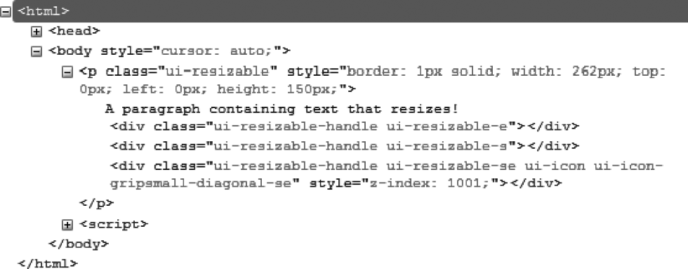

### 13.2　格式化内容

`resizable ()` 方法会在右下角显示一个表示可以缩放的小图标。此外，它也会给可缩放的HTML元素添加新的CSS类。

例如，在图13-2中，jQuery UI会根据 `resizable ()` 方法修改HTML代码（图中的代码是用Firefox的Firebug扩展查看的）。


<center class="my_markdown"><b class="my_markdown">图13-2　由 `resizable ()` 方法生成的HTML代码</b></center>

`<p>` 元素被赋予了名为 `ui-resizable` 的CSS类，而作为其子元素的三个新建的 `<div>` 元素，则遵循以下的规则（首先都有名为 `ui-resizable-handle` 的CSS类）。

+ 元素的右侧使用 `ui-resizable-e` 类（e代表East）。
+ 元素的底部使用 `ui-resizable-s` 类（s代表South）。
+ 右下角的图标使用 `ui-resizable-se` 类（se代表Southeast）。

你可以使用元素的CSS类来定制其外观。例如，我们修改 `ui-resizable-e` 和 `ui-resizable-s` 类的话，就可以强制用户使用右下角的小图标而不是侧边来缩放元素。要改变外观显示的话，只修改这些元素的 `width` 和 `height` 属性值即可（ `width` 修改了 `ui-resizable-e` 元素的宽度，而 `height` 修改了 `ui-resizable-s` 元素的高度）。

在HTML代码中加入 `<style>` 标签来修改这些元素：

```css
<script src = jquery.js></script>
<script src = jqueryui/js/jquery-ui-1.8.16.custom.min.js></script>
<link rel=stylesheet type=text/css 
　　　 href=jqueryui/css/smoothness/jquery-ui-1.8.16.custom.css />
<style type=text/css> 
　.ui-resizable-e { 
　　width : 0px; 
　}
　.ui-resizable-s {
　　height : 0px; 
　}
</style>
<p style="border:solid 1px;width:150px">
　　 A paragraph containing text that resizes!
</p>
<script> 
$("p").resizable ();
</script>
```

这样一来，用户就只能使用小图标来缩放元素了。在下一节中，我们可以看到如何提示用户使用某一条侧边来缩放元素。

