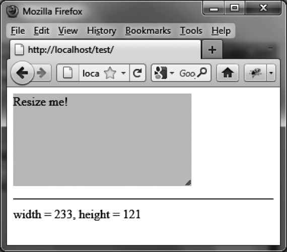

### 13.5.1　缩放时显示元素的尺寸

在一次缩放操作中可以使用 `resize` 事件来决定每一次鼠标移动所带来的效果（如图13-3所示）。


<center class="my_markdown"><b class="my_markdown">图13-3　缩放时显示元素的尺寸</b></center>

```css
<script src = jquery.js></script>
<script src = jqueryui/js/jquery-ui-1.8.16.custom.min.js></script>
<link rel=stylesheet type=text/css 
　　　 href=jqueryui/css/smoothness/jquery-ui-1.8.16.custom.css />
<p style="background-color:gainsboro;width:150px;"> 
　　　Resize me!
</p>
<hr />
<span id=result></span> 
<script>
$("p").resizable ({
　 resize : function (event, ui) 
　 {
　　　$("#result").text ("width = " + ui.size.width +
　　　　　　　　　　　　　　", height = " + ui.size.height); 
　 } 
});
</script>
```

