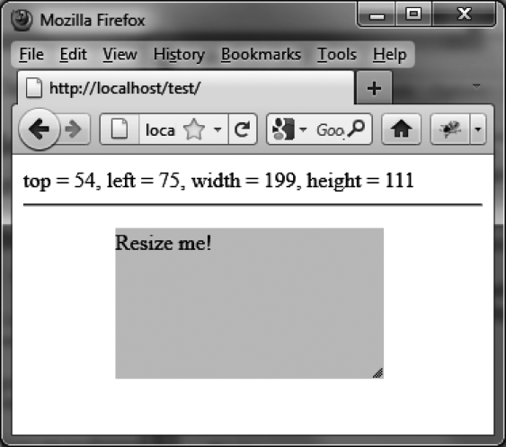

### 13.5.2　缩放时显示元素的位置

元素在页面上的位置通常是固定的。然而，如果你通过顶边或者左侧边来缩放元素的话，则元素位置也就有可能被改变了。这意味着，元素的 `top` 和 `left` 坐标值有可能被修改，使元素在页面上的位置随之变更。下面的代码可以在缩放元素时显示其位置坐标：

```css
<script src = jquery.js></script>
<script src = jqueryui/js/jquery-ui-1.8.16.custom.min.js></script>
<link rel=stylesheet type=text/css 
　　　 href=jqueryui/css/smoothness/jquery-ui-1.8.16.custom.css />
<p style="background-color:gainsboro; width:150px; 
　　　　　　position:absolute;top:100px;left:100px">
　　Resize me! 
</p>
<span id=result></span>
<hr />
<script>
$("p").resizable ({
　 handles : "n, e, s, w, ne, se, nw, sw", 
　 resize : function (event, ui) 
　 {
　　　$("#result").text ("top = " + ui.position.top +
　　　　　　　　　　　　　　", left = " + ui.position.left +
　　　　　　　　　　　　　　", width = " + ui.size.width +
　　　　　　　　　　　　　　", height = " + ui.size.height); 
　 } 
});
</script>
```

在默认情况下，示例元素位于（100, 100）处。当我们通过顶边和左侧边放大它的时候（而不仅仅是通过右边和底边来放大），其位置会随之变化（如图13-4所示）。


<center class="my_markdown"><b class="my_markdown">图13-4　缩放过程中显示的元素位置</b></center>

