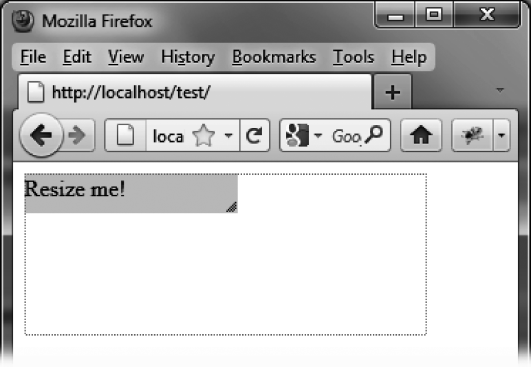
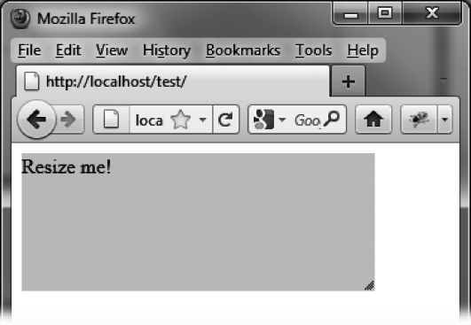

### 13.5.3　在缩放过程中执行动画

要在缩放过程中执行一个动画，将 `options.animate` 值设为 `true` 即可：

```css
<script src = jquery.js></script>
<script src = jqueryui/js/jquery-ui-1.8.16.custom.min.js></script>
<link rel=stylesheet type=text/css 
　　　 href=jqueryui/css/smoothness/jquery-ui-1.8.16.custom.css />
<p style="background-color:gainsboro; width:150px;"> 
　　　Resize me!
</p>
<script>
$("p").resizable ({
　 animate : true
});
</script>
```

此时元素并不会马上响应缩放操作。当鼠标按键松开时动画才会开始执行。如果要查看元素的缩放过程，则可以使用 `helper` 选项。这一选项指定一个CSS类，这个将具有一个新的 `<div>` 元素作为被缩放的对象，而此元素也会在鼠标按键松开时被删除。

```css
<script src = jquery.js></script>
<script src = jqueryui/js/jquery-ui-1.8.16.custom.min.js></script>
<link rel=stylesheet type=text/css 
　　　 href=jqueryui/css/smoothness/jquery-ui-1.8.16.custom.css />
<style type=text/css> 
　 .helper {
　 border : dotted 1px red; 
} 
</style>
<p style="background-color:gainsboro; width:150px;"> 
　　　Resize me!
</p>
<script>
$("p").resizable ({
　 animate : true, 
　 helper : "helper"
});
</script>
```

图13-5中所示的红色虚线框即是由jQuery UI创建的 `options.helper` 类元素。它会在鼠标按键松开时消失。


<center class="my_markdown"><b class="my_markdown">图13-5　缩放过程中的元素显示</b></center>

缩放操作结束后，红线消失，而后元素变为新的尺寸（如图13-6所示）。


<center class="my_markdown"><b class="my_markdown">图13-6　缩放后的元素</b></center>

