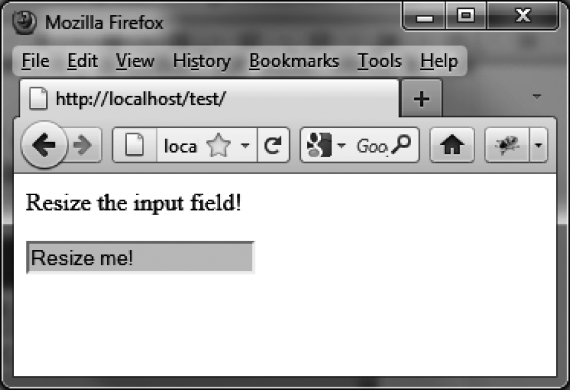
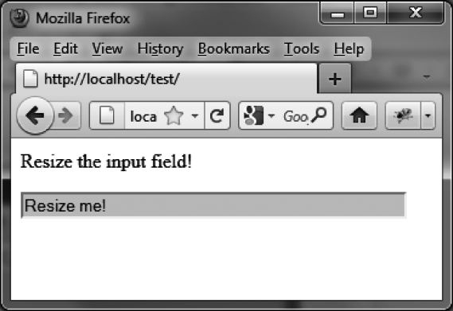
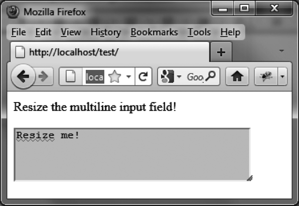

### 13.5.4　创建一个可缩放的文本框

可缩放的文本框既可以是单行的，也可以是多行的。下面我们就分别实现这两种文本框。

#### 1．单行输入框

在一个表单中，比起一个固定尺寸的输入框，为什么不给用户一个可以自由缩放的文本框呢？图13-7及图13-8演示了这样一个例子，它的用法几乎和别的元素一样。


<center class="my_markdown"><b class="my_markdown">图13-7　缩放前的输入框</b></center>

输入框必须被插入到另一个供缩放的元素中，此例中是一个 `<div>` 元素。


<center class="my_markdown"><b class="my_markdown">图13-8　横向拉伸后的输入框</b></center>

```css
<script src = jquery.js></script>
<script src = jqueryui/js/jquery-ui-1.8.16.custom.min.js></script>
<link rel=stylesheet type=text/css 
　　　 href=jqueryui/css/smoothness/jquery-ui-1.8.16.custom.css />
<p> Resize the input field!</p>
<div style="width:150px;height:20px">
　<input style="background-color:gainsboro; width:100%;"
　　　　　value="Resize me!" /> 
</div>
<script>
$("div").resizable ({
　 handles : "e"
});
</script>
```

上面的代码中指定了 `<div>` 元素的 `width` 和 `height` 。而这里其实只有 `height` 属性是必需的（如果没有 `height` 属性，在IE下可能无法启用缩放功能）。 `width` 属性被设为了 `150px` ，以避免其自动占满整个页面宽度。

`<input>` 元素的 `width` 属性值为 `100%` ，这使得 `input` 元素始终和父元素（即实际被缩放的 `<div>` 元素）一样宽。

我们只给 `handles` 选项赋予值 `"e"` ，这样只能发生在右侧边拉伸元素，否则元素也可以在高度方向上放大。

#### 2．多行输入框

除了能横向拉伸一个单行输入框，我们还可以缩放多行输入框（ `<textarea>` 元素）。图13-9展示了这样一个例子。


<center class="my_markdown"><b class="my_markdown">图13-9　缩放多行输入框</b></center>

这里的用法和之前相同，我们将 `<textarea>` 元素插入到一个 `<div>` 元素中，实际被缩放的是外层的 `<div>` 元素：

```css
<script src = jquery.js></script>
<script src = jqueryui/js/jquery-ui-1.8.16.custom.min.js></script>
<link rel=stylesheet type=text/css 
　　　 href=jqueryui/css/smoothness/jquery-ui-1.8.16.custom.css />
<p> Resize the multiline input field!</p>
<div style="width:150px;height:40px"> 
　<textarea style="background-color:gainsboro; 
　　　　　　　　　　　width:99%;height:99%">Resize me! 
　</textarea> 
</div>
<script> 
$("div").resizable (); 
</script>
```

我们将 `width` 和 `height` 都指定为99%而不是100%，是为了让右下角的缩放图标不被滚动条所遮盖住。

<a class="my_markdown" href="['#ac131']">①</a>　原书这里只有 `helper` 、 `originalPosition` 、 `originalSize` 、 `postion` 和 `size`  5个属性，但实际代码中有7个属性。表13-7的内容译者也做了相应的补充。——译者注


