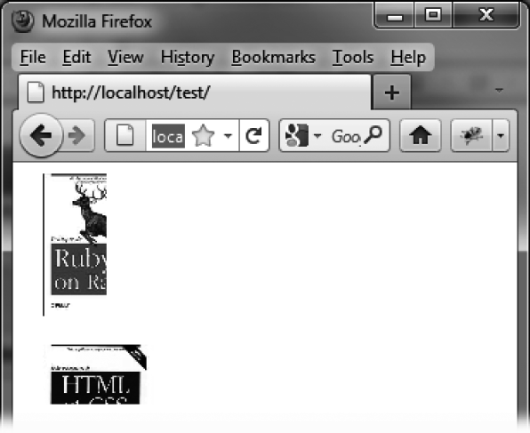
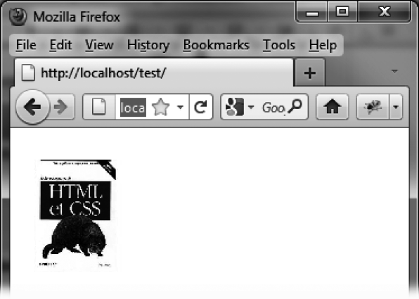

### 14.1.2　 `blind` 特效

`blind` 特效可以用来显示或是隐藏元素，使其在指定的方向出现或消失。表14-2中列出了此特效的相关选项。

<center class="my_markdown"><b class="my_markdown">表14-2　管理 `blind` 特效的选项</b></center>

| 选项 | 功能 |
| :-----  | :-----  | :-----  | :-----  |
| `options.mode` | 显示（ `"show"` ）或隐藏（ `"hide"` ）元素。默认值为 `"hide"` |
| `options.direction` | 指定元素出现或消失时来去的方向（水平 `"horizontal"` 或垂直 `"vertical"` ）。默认值为 `"vertical"` |

在下面的例子中，第一张图片会在水平方向消失，而同时第二张图片会在垂直方向出现。图14-1展示了进行中的特效，图14-2则展示了最终的结果：


<center class="my_markdown"><b class="my_markdown">图14-1　进行中的 `blind` 特效：第一张图片在水平方向上消失，而同时第二张图片在垂直方向上出现</b></center>


<center class="my_markdown"><b class="my_markdown">图14-2　完成后的 `blind` 特效：第一张图片完全消失，其位置被后来的第二张图片取代</b></center>

```css
<script src = jquery.js></script>
<script src = jqueryui/js/jquery-ui-1.8.16.custom.min.js></script>
<link rel=stylesheet type=text/css 
　　　 href=jqueryui/css/smoothness/jquery-ui-1.8.16.custom.css />
<br /> 

<script>
$("#img1").effect ("blind", { mode : "hide", direction : "horizontal" }, 10000); 
$("#img2").effect ("blind", { mode : "show", direction : "vertical" }, 10000); 
</script>
```

