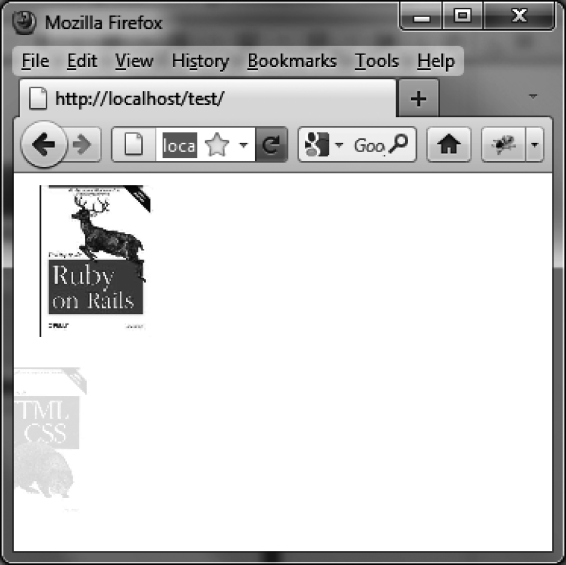

### 14.1.6　 `drop` 特效

`drop` 特效是在拖动的同时，以降低元素透明度的方式来显示和隐藏元素。表14-6中列出了此特效的相关选项。

<center class="my_markdown"><b class="my_markdown">表14-6　管理 `drop` 特效的选项</b></center>

| 选项 | 功能 |
| :-----  | :-----  | :-----  | :-----  |
| `options.mode` | 显示（ `"show"` ）或隐藏（ `"hide"` ）元素。默认值为"hide" |
| `options.direction` | 指定元素被拖动的方向： `"up"` （上）、 `"down"` （下）、 `"left"` （左，也是默认值）或 `"right"` （右） |
| `options.distance` | 元素滑过的距离（单位为像素） |

下面是一个使用 `drop` 特效的示例。在这个例子中则是第一本书出现而第二本书消失。结果如图14-6所示。

```css
<script src = jquery.js></script>
<script src = jqueryui/js/jquery-ui-1.8.16.custom.min.js></script>
<link rel=stylesheet type=text/css 
　　　 href=jqueryui/css/smoothness/jquery-ui-1.8.16.custom.css />
<br /> 

<script>
$("#img1").effect ("drop", { mode : "show" }, 1000); 
$("#img2").effect ("drop", { mode : "hide" }, 1000);
</script>
```


<center class="my_markdown"><b class="my_markdown">图14-6　 `drop` 特效</b></center>

