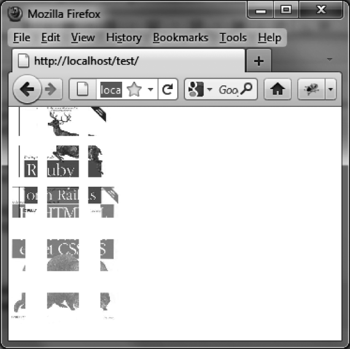

### 14.1.7　 `explode` 特效

`explode` 特效能使元素以碎片的形式突然迸发出来或是消失，就好像爆炸了一样（如图14-7所示）。表14-7中列出了此特效的相关选项。

```css
<script src = jquery.js></script>
<script src = jqueryui/js/jquery-ui-1.8.16.custom.min.js></script>
<link rel=stylesheet type=text/css
　　　 href=jqueryui/css/smoothness/jquery-ui-1.8.16.custom.css />
<br /> 

<script>
$("#img1").effect ("explode", { mode : "show" }, 1000); 
$("#img2").effect ("explode", { mode : "hide" }, 1000); 
</script>
```

<center class="my_markdown"><b class="my_markdown">表14-7　管理 `explode` 特效的选项</b></center>

| 选项 | 功能 |
| :-----  | :-----  | :-----  | :-----  |
| `options.mode` | 显示（ `"show"` ）或隐藏（ `"hide"` ）元素。默认值为"hide" |
| `options.pieces` | 指定将元素分作几个碎片。默认值为9个 |


<center class="my_markdown"><b class="my_markdown">图14-7　 `explode` 特效</b></center>

