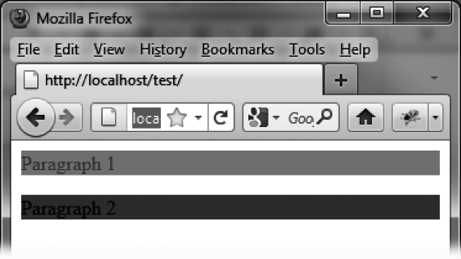
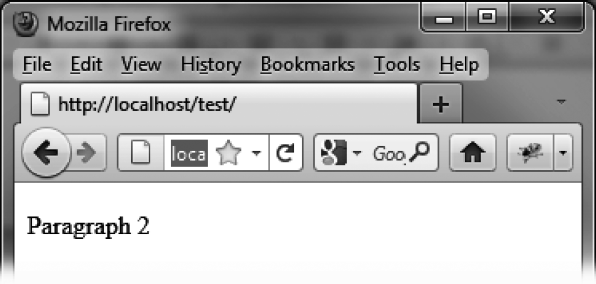

### 14.1.9　 `highlight` 特效

`highlight` 特效能以改变背景色的方式来显示和隐藏元素，如图14-8和图14-9所示。表14-9中列出了此特效的相关选项。


<center class="my_markdown"><b class="my_markdown">图14-8　 `highlight` 特效：第一段逐渐消失，第二段浮现</b></center>


<center class="my_markdown"><b class="my_markdown">图14-9　 `highlight` 特效完成后：第一段完全消失，其位置被第二段占据</b></center>

<center class="my_markdown"><b class="my_markdown">表14-9　管理 `highlight` 特效的选项</b></center>

| 选项 | 功能 |
| :-----  | :-----  | :-----  | :-----  |
| `options.mode` | 显示（ `"show"` ）或隐藏（ `"hide"` ）元素。默认值为 `"show"` |
| `options.color` | 为元素设定一个背景色，它会逐渐过渡到元素原本样式所定义的背景色 |

```css
<script src = jquery.js></script>
<script src = jqueryui/js/jquery-ui-1.8.16.custom.min.js></script>
<link rel=stylesheet type=text/css 
　　　 href=jqueryui/css/smoothness/jquery-ui-1.8.16.custom.css />
<p id=p1> Paragraph 1 </p> 
<p id=p2> Paragraph 2 </p>
<script>
$("#p1").effect ("highlight", { mode : "hide", color : "black" }, 10000); 
$("#p2").effect ("highlight", { mode : "show", color : "black" }, 10000); 
</script>
```

在图14-9中，第二段已经完全展现，背景也已呈现白色。

