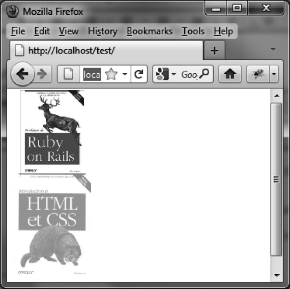

### 14.1.10　 `puff` 特效

`puff` 特效是在拉伸或挤压元素的同时，以更改其透明度的方式来显示和隐藏元素。表14-10中列出了此特效的相关选项。

<center class="my_markdown"><b class="my_markdown">表14-10　管理 `puff` 特效的选项</b></center>

| 选项 | 功能 |
| :-----  | :-----  | :-----  | :-----  |
| `options.mode` | 显示（ `"show"` ）或隐藏（ `"hide"` ）元素。默认值为 `"hide"` |
| `options.percent` | 指定元素放大或是缩小的比例（若比例大于100%，则元素显示效果为缩小到原尺寸的同时渐清晰，而消失效果为放大的同时渐隐；反之若比例小于100%，则显示效果为放大到原尺寸的同时渐清晰，而消失效果为缩小的同时渐隐）。默认值为150% |

在下面的例子中，第一本书以逐渐缩小到原尺寸的方式出现在页面上，而第二本书则以放大的方式渐隐消失。结果如图14-10所示。

```css
<script src = jquery.js></script>
<script src = jqueryui/js/jquery-ui-1.8.16.custom.min.js></script>
<link rel=stylesheet type=text/css 
　　　 href=jqueryui/css/smoothness/jquery-ui-1.8.16.custom.css />
<br /> 

<script>
$("#img1").effect ("puff", { mode : "show" }, 1000); 
$("#img2").effect ("puff", { mode : "hide" }, 1000); 
</script>
```


<center class="my_markdown"><b class="my_markdown">图14-10　 `puff` 特效</b></center>

