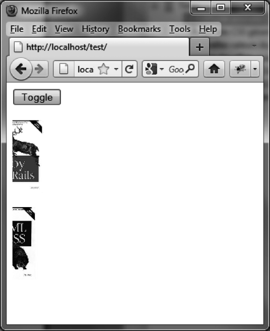

### 14.2　 `show ()` 、 `hide ()` 以及 `toggle ()` 方法

前面介绍过的特效都是使用 `mode` 选项来隐藏（ `"hide"` ）或显示（ `"show"` ）元素的。

jQuery UI还允许我们使用 `show ()` 和 `hide ()` 方法，从而可以不用在 `options` 参数中指定 `mode` 选项。而对于 `toggle ()` 方法，它会根据元素显示与否来自动切换 `show ()` 或者 `hide ()` 方法。

要用指定的特效来显示元素，可以按如下形式使用：

```css
$(selector, context).show (effectName, options, duration, callback);
```

要用指定的特效来隐藏元素，可以按如下形式使用：

```css
$(selector, context).hide (effectName, options, duration, callback);
```

要来回变换显示或是隐藏，可以按如下形式使用：

```css
$(selector, context).toggle (effectName, options, duration, callback);
```

我们可以以 `slide` 特效为例，用上面这些方法来替代之前使用过的 `effect ()` 方法。我们在页面上创建了一个Toggle按钮，在被单击的时候会用 `slide` 特效来显示或隐藏元素（如图14-12所示）。


<center class="my_markdown"><b class="my_markdown">图14-12　使用 `toggle ()` 方法</b></center>

```css
<script src = jquery.js></script>
<script src = jqueryui/js/jquery-ui-1.8.16.custom.min.js></script>
<link rel=stylesheet type=text/css 
　　　 href=jqueryui/css/smoothness/jquery-ui-1.8.16.custom.css />
<button onclick=toggle ()>Toggle </button><br /><br />
<br />

<script>
function toggle ()
{
　 $("#img1").toggle ("slide", 10000); 
　 $("#img2").toggle ("slide", 10000); 
}
</script>
```

