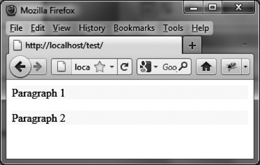
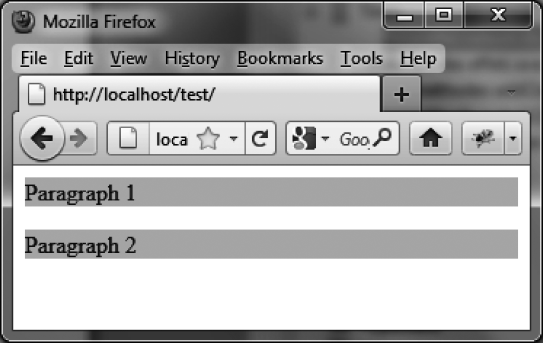

### 14.3.1　管理颜色的CSS属性

和jQuery的 `animate ()` 方法不同，jQuery UI允许使用色彩相关的CSS属性值，如 `color` 、  `background-color` 、  `border-color` 等。

在下面的例子中，我们要创建两段逐渐改变背景色和字体色的文字：一开始是白底黑字（如图14-13所示），然后逐渐变成黑底（ `"background-color":"black"` ）白字（ `"color":"white"` ）。图14-14展示了特效进行中的某一时刻，而最终结果如图14-15所示。


<center class="my_markdown"><b class="my_markdown">图14-13　应用特效前的两段文字</b></center>


<center class="my_markdown"><b class="my_markdown">图14-14　使用 `animate ()` 方法更改颜色的过程中的某一瞬间</b></center>


<center class="my_markdown"><b class="my_markdown">图14-15　使用 `animate ()` 方法更改颜色的最终结果</b></center>

```css
<script src = jquery.js></script>
<script src = jqueryui/js/jquery-ui-1.8.16.custom.min.js></script>
<link rel=stylesheet type=text/css 
　　　href=jqueryui/css/smoothness/jquery-ui-1.8.16.custom.css />
<p> Paragraph 1 </p> 
<p> Paragraph 2 </p>
<script>
$("p").animate ({
　 "background-color" : "black", 
　 color : "white"
}, 10000); 
</script>
```

