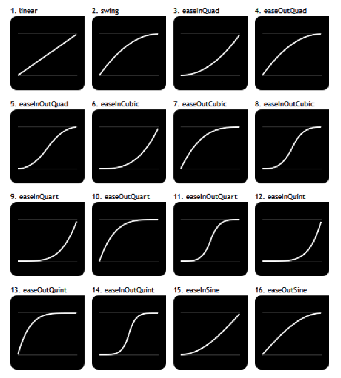
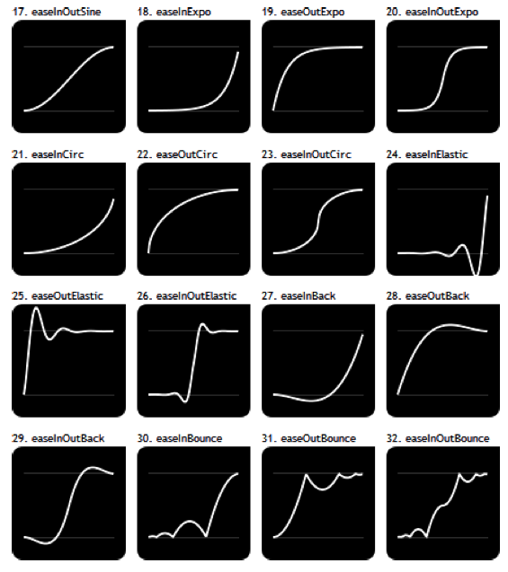

### 14.3.2　新的 `easing` 选项值

jQuery的 `animate ()` 方法只支持 `easing` 选项的 `linear` 和 `swing` 两个值。回想一下，这个选项是用来指定特效的演进方式：先快后慢，或先慢后快等。

新的 `easing` 选项值在图14-16和图14-17中列出。你可以通过曲线来预览特效的演进方式。

<b class="my_markdown">图14-16　 `easing` 选项的可用值（一）</b>

<b class="my_markdown">图14-17　 `easing` 选项的可用值（二）</b>

