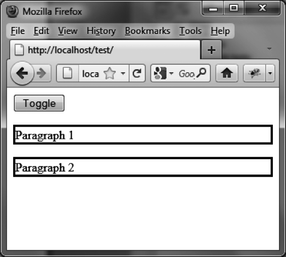
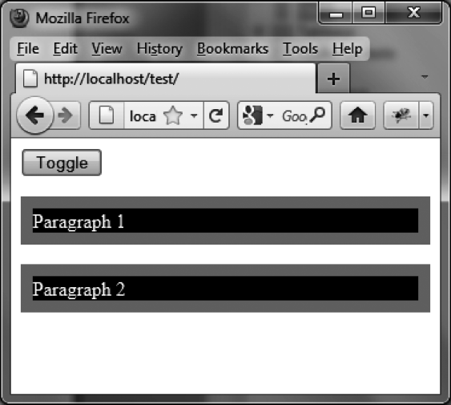

### 14.4.3　使用 `toggleClass ()` 方法的示例

下面是一个使用 `toggleClass ()` 方法的示例。其中的Toggle按钮允许你在每一个段落上都添加或移除CSS类（此例中为class1），从而生成视觉特效。当应用了新样式（第一次单击后）后，再单击一下按钮便可以还原最初的样式（如图14-18和图14-19所示）。


<center class="my_markdown"><b class="my_markdown">图14-18　使用 `toggleClass ()` 方法：单击Toggle按钮之前</b></center>


<center class="my_markdown"><b class="my_markdown">图14-19　使用 `toggleClass ()` 方法：单击Toggle按钮之后</b></center>

CSS属性 `border-style` 是不能缩放的，因此没有被包含在CSS类中：

```css
<script src = jquery.js></script>
<script src = jqueryui/js/jquery-ui-1.8.16.custom.min.js></script>
<link rel=stylesheet type=text/css 
　　　 href=jqueryui/css/smoothness/jquery-ui-1.8.16.custom.css />
<style type=text/css>
　 .class1{
　 border-width : 10px; 
　 border-color : red; 
　 background-color : black; 
　 color : white;
　} 
</style>
<button onclick=toggle ()> Toggle </button>
<p style=border-style:solid> Paragraph 1 </p>
<p style=border-style:solid> Paragraph 2 </p>
<script>
function toggle ()
{
　$("p").toggleClass ("class1", 1000); 
}
</script>
```


