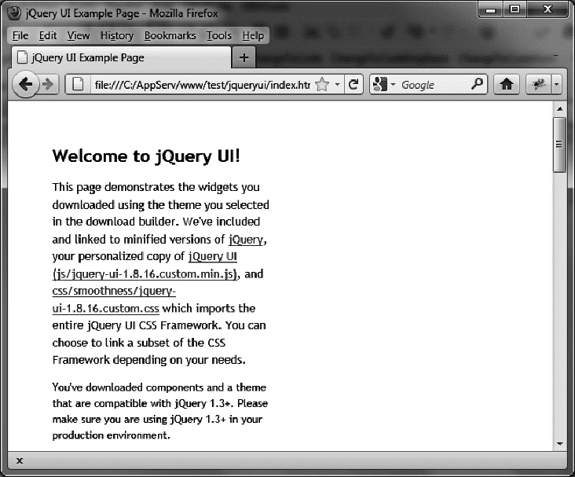
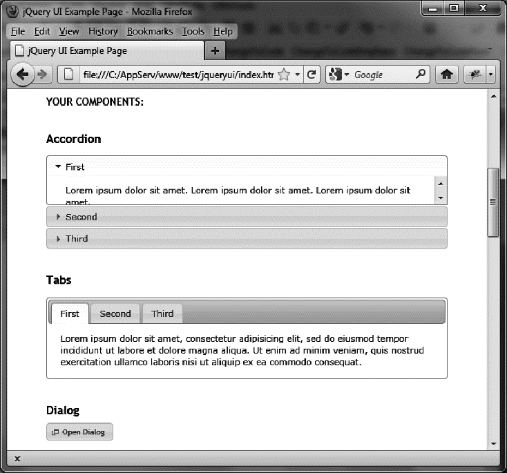

### 1.2　jQuery UI概览

为了简要了解jQuery UI，请在浏览器中打开index.html文件（如图1-1所示）。

<b class="my_markdown">图1-1　jQuery UI首页</b>

在这个文件中，你可以看到jQuery UI添加的不同功能，如图1-2所示，包括：

+ 折叠菜单（accordion menu）；
+ 输入框的自动补全机制（autocompletion mechanism）；
+ 漂亮的按钮（button）和复选框（checkbox）；
+ 便于页面展示的选项卡机制（tab mechanism）；
+ 显示在页面最上层的对话框（dialog box）；
+ 自定义图标（custom icon）；
+ 滑块（slider）；
+ 日历（calendar）；
+ 进度条（progress bar）。

我们将会在本书的后面章节，讨论这些功能。我们还会讨论其他的机制，比如拖放、新的视觉特效、CSS主题文件等。

<b class="my_markdown">图1-2　jQuery UI首页：组件列表</b>

