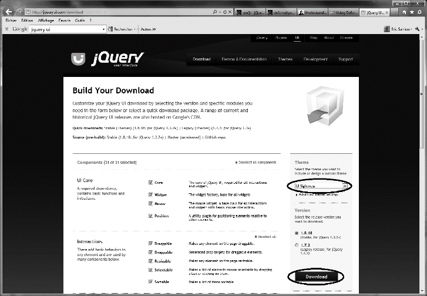
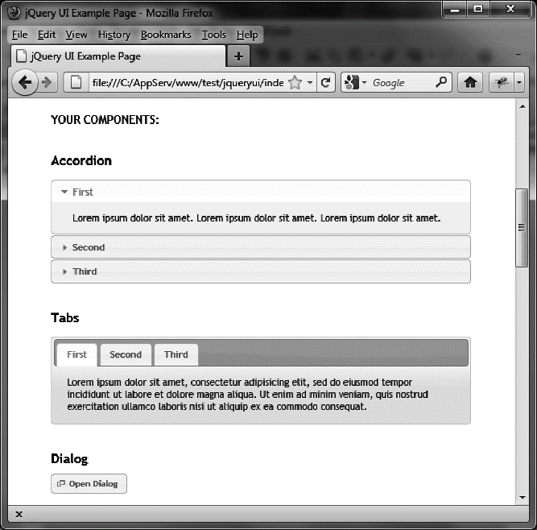

### 1.3　什么是CSS主题

我们之前提到的CSS主题是什么呢？为了弄清楚这个，只需按主题选择下载一个新的jQuery UI的定制版本。为此，打开<a class="my_markdown" href="['http://jqueryui.com/download']">http://jqueryui.com/download</a>，显示的页面如图 1-3所示。

<b class="my_markdown">图1-3　下载定制的jQuery UI主题</b>

选择右边下拉框列表中的UI lightness主题，然后单击Download（下载）按钮获取该主题的ZIP文件。这个ZIP文件的目录和之前下载的ZIP文件的目录是一模一样的，只是css目录中的CSS文件换成了新主题的对应文件。打开jqueryui中新的index.html文件（这个文件覆盖了之前的那个），就会看到新的主题了<a class="my_markdown" href="['#anchor11']">①</a>。主题的示例效果如图1-4所示。

每种主题都是背景颜色、字体及其他屏幕元素的独特组合。如果我们查看css目录，我们将会看到刚才下载的两个主题子目录：

+ smoothness是下载jQuery UI时的默认主题；
+ ui-lightness是我们刚从<a class="my_markdown" href="['http://jqueryui.com/download']">http://jqueryui.com/download</a>页面上下载的主题。

<b class="my_markdown">图1-4　ui-lightness主题</b>

