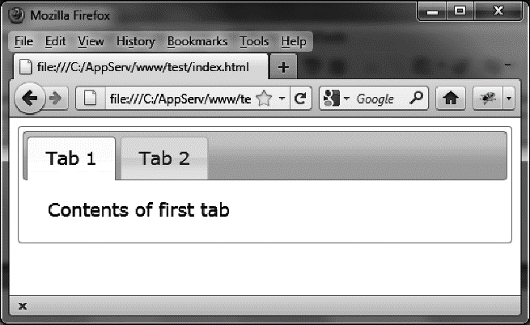

### 1.4.1　未压缩文件

未压缩的文件位于jQuery UI安装目录（jqueryui）下的development-bundle目录。

#### 1．JavaScript文件

ui目录（位于development-bundle下）包含了JavaScript文件。jquery.ui.core.js文件包含了基本功能（必须引入），而其他的文件需要时再引入。最终会有一个包含了所有JavaScript文件的custom.js（例如，jquery-ui-1.8.16.custom.js）文件，这样就无须单独引入每个文件了。minified目录（位于ui目录下）包含了压缩格式的相同文件。

#### 2．CSS文件

themes目录（位于development-bundle目录下）包含了CSS文件。它由多个目录组成，每个目录包含一个主题（比如，base、smoothness及ui-lightness目录）。每个主题下有一个images目录和其他的CSS文件。

jquery.ui.core.css文件包含了基本功能（必需的），而其他文件需要时再引入。jquery.ui.theme.css文件定义了主题自身的样式（必需的）。

jquery.ui.base.css文件包含了development-bundle目录下除了jquery.ui.theme.css外的所有文件。jquery.ui.all.css文件包含了所有的文件（即jquery.ui.base.css和jquery.ui.theme.css）。

最终，会有一个包含所有CSS文件的custom.css（例如，jquery-ui-1.8.16.custom.css）文件，而无须单独引入每个文件了（这一点对于jquery.ui.all.css也是一样的，只是jquery.ui.all.css通过CSS指令@import引入其他文件，而custom.css把所有文件的内容都包括在内了）。

#### 3．引入未压缩文件的HTML页面示例

我们想显示一个包含两个选项卡的简单页面。主要的JavaScript文件是jquery.ui.tabs.js，主要的CSS文件是jquery.ui.tabs.css。主页面会引入以下基础文件：<sup class="my_markdown">①</sup>

```css
<script src = "jquery.js"></script>
<script src = "jqueryui/development-bundle/ui/jquery.ui.core.js"></script>
<script src = "jqueryui/development-bundle/ui/jquery.ui.widget.js"></script>
<script src = "jqueryui/development-bundle/ui/jquery.ui.tabs.js"></script>
<link rel=stylesheet type=text/css
　　　 href=jqueryui/development-bundle/themes/smoothness/jquery.ui.core.css />
<link rel=stylesheet type=text/css
　　　 href=jqueryui/development-bundle/themes/smoothness/jquery.ui.theme.css/>
<link rel=stylesheet type=text/css
　　　 href=jqueryui/development-bundle/themes/smoothness/jquery.ui.tabs.css />
```

这里的jquery.js文件和jqueryui目录位于同一层目录级别。它是标准的jQuery JavaScript文件。

core.js文件是必须引入的，tab.js文件还需要引入依赖的widget.js（正如tab.js文件中指出的）。<a class="my_markdown" href="['#anchor12']"><sup class="my_markdown">②</sup></a>

core.css文件是必须引入的，theme.css文件也是必须引入的。tab.css文件则包含了选项卡的详细样式定义。

既然已经搭建了页面的基本模块，我们再创建并标记两个选项卡，并在每个选项卡里面添加一些文字。下面的代码紧接着之前引入基础文件的那部分代码。

```css
<div id=tabs>
　 <ul>
　　 <li><a href=#tab1>Tab 1</a></li>
　　 <li><a href=#tab2>Tab 2</a></li>
　 </ul>
　 <div id=tab1>Contents of first tab</div>
　 <div id=tab2>Contents of the second tab</div>
　 </div>
<script>
$("#tabs").tabs ();
</script>
```

这段脚本的结果（一个包括两个选项卡的页面）如图1-5所示。


<center class="my_markdown"><b class="my_markdown">图1-5　我们的第一个使用jQuery UI的程序</b></center>

