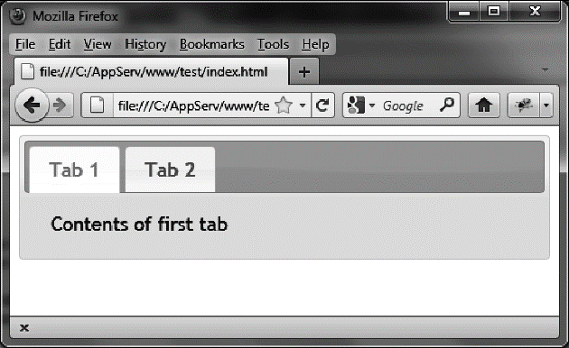

### 1.5　更换CSS主题

CSS主题最好的地方是允许你方便地更换页面的外观——仅需更换你想要使用的主题目录名字就可以了。比如，把smoothness换成ui-lightness。

在使用未压缩版本文件的页面中，只需把页面中每个smoothness目录改成ui-lightness即可（粗体部分所示）：

```css
<link rel=stylesheet type=text/css
　　　 href=jqueryui/development-bundle/themes/**ui-lightness**/jquery.ui.core.css />
<link rel=stylesheet type=text/css
　　　 href=jqueryui/development-bundle/themes/**ui-lightness**/jquery.ui.theme.css />
<link rel=stylesheet type=text/css
　　　 href=jqueryui/development-bundle/themes/**ui-lightness**/jquery.ui.tabs.css />
```

在使用压缩文件的页面中，把smoothness目录改成ui-lightness（粗体部分所示）：

```css
<link rel=stylesheet type=text/css
　　　 href=jqueryui/css/**ui-lightness**/jquery-ui-1.8.16.custom.css />
```

HTML页面将使用新主题（如图1-6所示）。


<center class="my_markdown"><b class="my_markdown">图1-6　使用ui-lightness主题的HTML页面</b></center>

