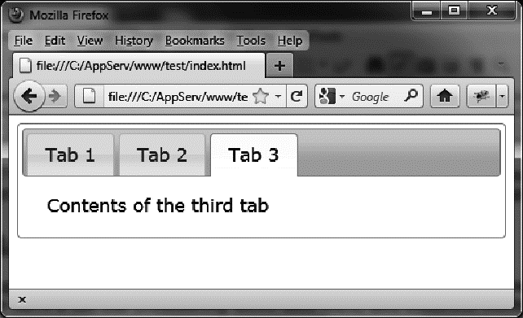
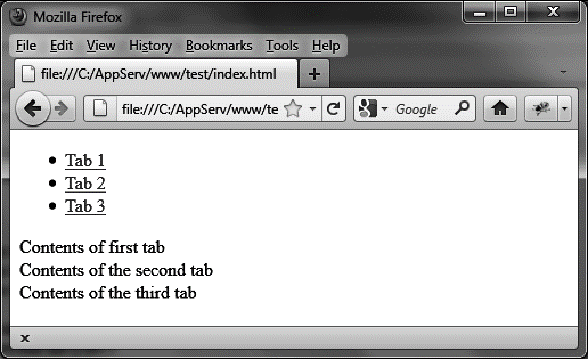

### 2.1　选项卡的基本用法

假设我们想要编写一段HTML代码来显示图2-1所示的选项卡。它有一个选项卡栏（包含3个选项卡）并且每个选项卡里面的内容是不同的。


<center class="my_markdown"><b class="my_markdown">图2-1　HTML页面中的选项卡</b></center>

要用jQuery UI创建这种类型的页面，需要以下内容：

+ 一个包含整个选项卡的 `<div>` 块；
+ 一个构成选项卡栏的 `<ul>` 元素；
+ 每个选项卡对应的一个 `<li>` 元素；
+ 每个选项卡的窗口对应的一个 `<div>` 元素。

下面是创建如图2-1所示页面的代码：

```css
<script src = jquery.js></script>
<script src = jqueryui/js/jquery-ui-1.8.16.custom.min.js></script>
<link rel=stylesheet type=text/css
　　　 href=jqueryui/css/smoothness/jquery-ui-1.8.16.custom.css />
<div id=tabs>
　<ul>
　　<li><a href=#tab1>Tab 1</a></li>
　　<li><a href=#tab2>Tab 2</a></li>
　　<li><a href=#tab3>Tab 3</a></li>
　</ul>
　<div id=tab1>Contents of first tab</div>
　<div id=tab2>Contents of the second tab</div>
　<div id=tab3>Contents of the third tab</div>
</div>
<script>
</script>
```

如果在浏览器中打开此页面（如图2-2所示），你会看到结果和预期的很不一样。为了得到想要的结果，还必须使用jQuery UI的 `tabs()` 方法。


<center class="my_markdown"><b class="my_markdown">图2-2　选项卡在HTML页面中没有按预期的那样显示</b></center>

在页面的 `<script>` 标签里面添加下面这行代码（粗体部分所示），调用jQuery UI的 `tabs` 方法，使用选项卡来管理HTML元素：

```css
<script>
$("#tabs").tabs();
</script>
```

这样页面就会出现选项卡了。

`tabs ()` 方法是jQuery UI的多个方法中的一个，可以在由 `jQuery ()` 函数返回的jQuery类对象上调用该方法，然后由选择器选取的结果集中的元素就被转换成选项卡了。当用户单击某个选项卡时，会自动切换到该选项卡，这一切都是jQuery UI“透明地”在管理的。

