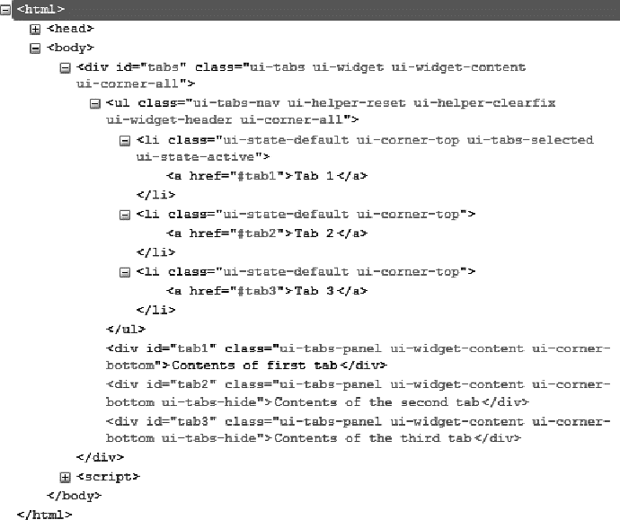
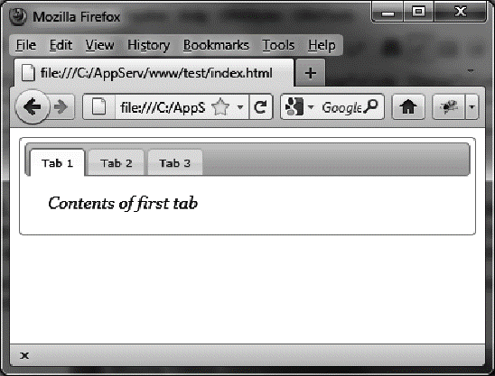

### 2.2　格式化内容

使用 `tabs ()` 方法会彻底改变页面中HTML元素的外观。实际上，该方法遍历了（jQuery UI内部实现）HTML代码，并给相关的元素（这里是选项卡）添加了新的CSS类，赋予了它们适当的样式。

图2-3展示了jQuery UI生成的HTML， `tabs ()` 方法改变了HTML DOM（文档对象模型）树（代码是用Firefox的Firebug扩展查看的）。


<center class="my_markdown"><b class="my_markdown">图2-3  `tab()` 方法产生的HTML代码</b></center>

可以修改元素的CSS类来自定义元素的显示样式。比如，如果修改了与 `<li>` 元素关联的 `ui-state-default CSS` 类，将会得到新的选项卡外观。同样地，如果修改了与 `<div>` 元素关联的 `ui-tabs-panel`  CSS类，则选项卡的内容外观就改变了。

在HTML中添加一个 `<style>` 标签，来修改这些元素的样式（粗体部分所示）：

```css
<script src = jquery.js></script>
<script src = jqueryui/js/jquery-ui-1.8.16.custom.min.js></script>
<link rel=stylesheet type=text/css
　　　 href=jqueryui/css/smoothness/jquery-ui-1.8.16.custom.css />
<style type=text/css>
　li.ui-state-default {
　　font-size : 10px;
　}
　div.ui-tabs-panel{
　　font-size : 15px;
　　font-family : georgia;
　　font-style : italic;
　}
</style>
<div id=tabs>
　<ul>
　　<li><a href=#tab1>Tab 1</a></li>
　　<li><a href=#tab2>Tab 2</a></li>
　　<li><a href=#tab3>Tab 3</a></li>
　</ul>
　　<div id=tab1>Contents of first tab</div>
　　<div id=tab2>Contents of the second tab</div>
　　<div id=tab3>Contents of the third tab</div>
　</div>
<script>
$("#tabs").tabs();
</script>
```

必须在jQuery UI样式的后面添加自己的样式，否则更改是会被“忽略”的。<a class="my_markdown" href="['#anchor21']"><sup class="my_markdown">①</sup></a>

如图2-4所示，应用新的样式后，选项卡及其内容的外观改变了。


<center class="my_markdown"><b class="my_markdown">图2-4　自定义样式的选项卡</b></center>

