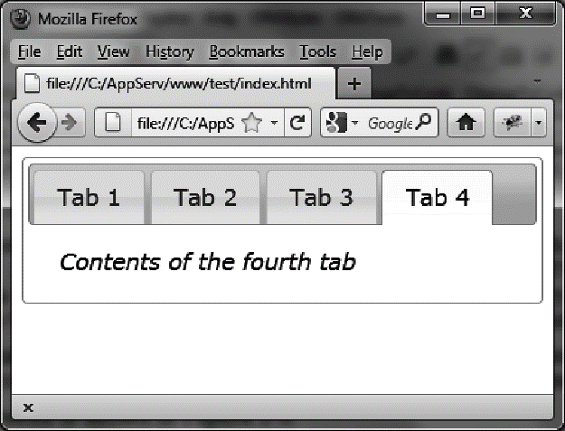

### 2.5.1　动态创建选项卡

我们想用JavaScript动态创建选项卡（及其内容）。在下面显示的代码中，首先用HTML代码创建了3个选项卡，然后用JavaScript添加了第4个：

```css
<script src = jquery.js></script>
<script src = jqueryui/js/jquery-ui-1.8.16.custom.min.js></script>
<link rel=stylesheet type=text/css
　　　 href=jqueryui/css/smoothness/jquery-ui-1.8.16.custom.css />
<div id=tabs>
　<ul>
　　<li><a href=#tab1>Tab 1</a></li>
　　<li><a href=#tab2>Tab 2</a></li>
　　<li><a href=#tab3>Tab 3</a></li>
　</ul>
　<div id=tab1>Contents of first tab</div>
　<div id=tab2>Contents of the second tab</div>
　<div id=tab3>Contents of the thir d tab</div>
</div>
<script>
$("#tabs").tabs ({
　fx : { opacity : "toggle" },
}).tabs ("add", "#tab4", "Tab 4");
$("<i>Contents of the fourth tab</i>").appendTo("#tab4");
</script>
```

请注意我们是如何将第一个 `tabs ()` 方法和第二个 `tabs ()` 方法链接起来的。第一个 `tabs ()` 方法是必需的，因为是它把编写的HTML代码转变成了显示选项卡的代码（使用jQuery UI自动添加的CSS类），第二个 `tabs ()` 方法执行了 `"add"` 操作，这将在列表的末尾添加选项卡。

jQuery UI创建了选项卡，也创建了与之内容相应的 `<div>` 。由于这内容是空的，所以添加了最后的 `appendTo ()` 语句来添加内容。

结果如图2-5所示。


<center class="my_markdown"><b class="my_markdown">图2-5　第4个选项卡是动态创建的</b></center>

