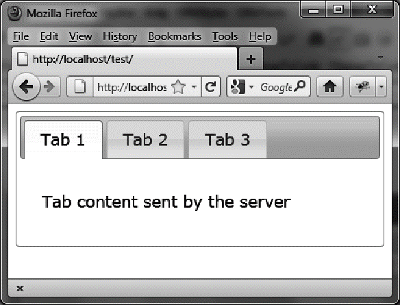

### 2.5.2　使用Ajax修改选项卡的内容

我们现在想使用服务器返回的HTML来初始化选项卡的内容。我们将使用PHP服务器。

我们将使用 `"url` "和 `"load` "操作来修改第一个选项卡（索引为0）的内容。增加的代码如粗体所示：

```css
<script src = jquery.js></script>
<script src = jqueryui/js/jquery-ui-1.8.16.custom.min.js></script>
<link rel=stylesheet type=text/css
　　　 href=jqueryui/css/smoothness/jquery-ui-1.8.16.custom.css />
<div id=tabs>
　<ul>
　　<li><a href=#tab1>Tab 1</a></li>
　　<li><a href=#tab2>Tab 2</a></li>
　　<li><a href=#tab3>Tab 3</a></li>
　</ul>
　<div id=tab1>Contents of first tab</div>
　<div id=tab2>Contents of the second tab</div>
　<div id=tab3>Contents of the third tab</div>
</div>
<script>
$("#tabs").tabs ({
　fx : { opacity : "toggle" },
}).tabs ("url", 0, "action.php").tabs ("load", 0);
</script>
```

首先指定URL，然后指定将以Ajax来加载内容（要按此顺序执行）。 `action.php` 文件如下：

```css
<?
　$txt = "<p> Tab content sent by the server </p>";
　$txt = utf8_encode($txt);
　echo ($txt);
?>
```

结果如图2-6所示。


<center class="my_markdown"><b class="my_markdown">图2-6　用Ajax动态创建的选项卡内容</b></center>

请注意，因为在HTML页面里使用了Ajax请求，这个HTML页面应该使用HTTP协议（即地址栏中的URL要以http开头）来显示，而不是简单地把HTML文件拖放到浏览器中就行了。

接下来看一下如何把信息通过Ajax传输给服务器。

