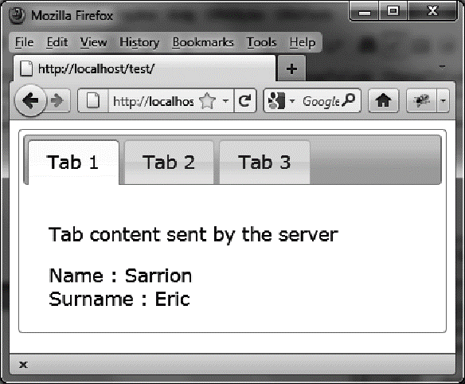

### 2.5.3　通过Ajax把信息传输给服务器

这个例子展示了如何通过Ajax把信息传输给服务器，来修改相应选项卡的内容。在这个例子中，把一个人的名字和姓氏发送给服务器，然后把服务器返回的内容显示在选项卡的内容中。传输的信息（名字和姓氏）是写在 `ajaxOptions` 选项中的 `data` 属性里的（如粗体部分所示）：

```css
<script src = jquery.js></script>
<script src = jqueryui/js/jquery-ui-1.8.16.custom.min.js></script>
<link rel=stylesheet type=text/css
　　　 href=jqueryui/css/smoothness/jquery-ui-1.8.16.custom.css />
<div id=tabs>
　<ul>
　　<li><a href=#tab1>Tab 1</a></li>
　　<li><a href=#tab2>Tab 2</a></li>
　　<li><a href=#tab3>Tab 3</a></li>
　</ul>
　<div id=tab1>Contents of first tab</div>
　<div id=tab2>Contents of the second tab</div>
　<div id=tab3>Contents of the third tab</div>
</div>
<script>
$("#tabs").tabs ({
　fx : { opacity : "toggle" },
　ajaxOptions : { data : { name : "Sarrion", surname : "Eric" } }
}).tabs ("url", 0, "action.php").tabs ("load", 0);
</script>
```

接收发送参数和显示选项卡内容的 `action.php` 文件如下:

```css
<?
　$name = $_REQUEST["name"];
　$surname = $_REQUEST["surname"];
　$name = utf8_decode ($name);
　$surname = utf8_decode ($surname);
　$txt = "<p> Tab content sent by the server </p>";
　$txt .= "Name : " . $name . "<br />";
　$txt .= "Surname : " . $surname . "<br />";
　$txt = utf8_encode ($txt);
　echo ($txt);
?>
```

结果如图2-7所示。


<center class="my_markdown"><b class="my_markdown">图2-7　使用Ajax发送的选项卡内容</b></center>

