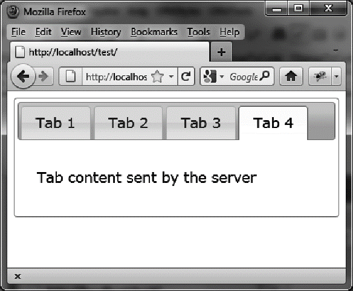

### 2.5.4　使用选项卡的 `add` 方法

我们想动态创建新的选项卡，并由Ajax动态初始化该选项卡的内容。 `add` 事件（插入新选项卡时会触发）可以完成这件事，比如发起插入内容的Ajax请求（如粗体部分所示）：

```css
<script src = jquery.js></script>
<script src = jqueryui/js/jquery-ui-1.8.16.custom.min.js></script>
<link rel=stylesheet type=text/css
 　　　href=jqueryui/css/smoothness/jquery-ui-1.8.16.custom.css />
<div id=tabs>
　<ul>
　　<li><a href=#tab1>Tab 1</a></li>
　　<li><a href=#tab2>Tab 2</a></li>
　　<li><a href=#tab3>Tab 3</a></li>
　</ul>
　<div id=tab1>Contents of first tab</div>
　<div id=tab2>Contents of the second tab</div>
　<div id=tab3>Contents of the third tab</div>
</div>
<script>
$("#tabs").tabs ({
　fx : { opacity : "toggle" },
　add : function (event, tab)
　{
　　$(tab.panel).load ("action.php");
　　}
　}).tabs ("add", "#tab4", "Tab 4");
</script>
```

`"add"` 操作触发了 `add` 事件，该事件会更新新建的选项卡的内容：

```css
<?
　$txt = "<p> Tab content sent by the server </p>";
　$txt = utf8_encode ($txt);
　echo($txt);
?>
```

结果如图2-8所示。


<center class="my_markdown"><b class="my_markdown">图2-8　使用add事件</b></center>

