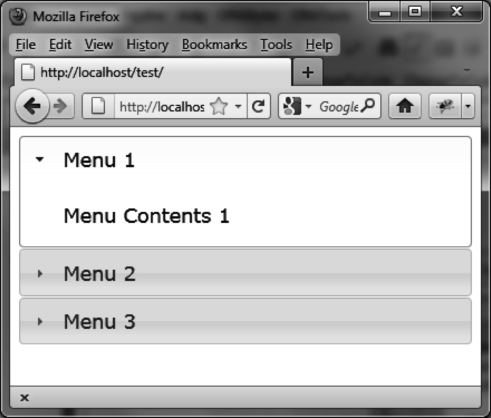
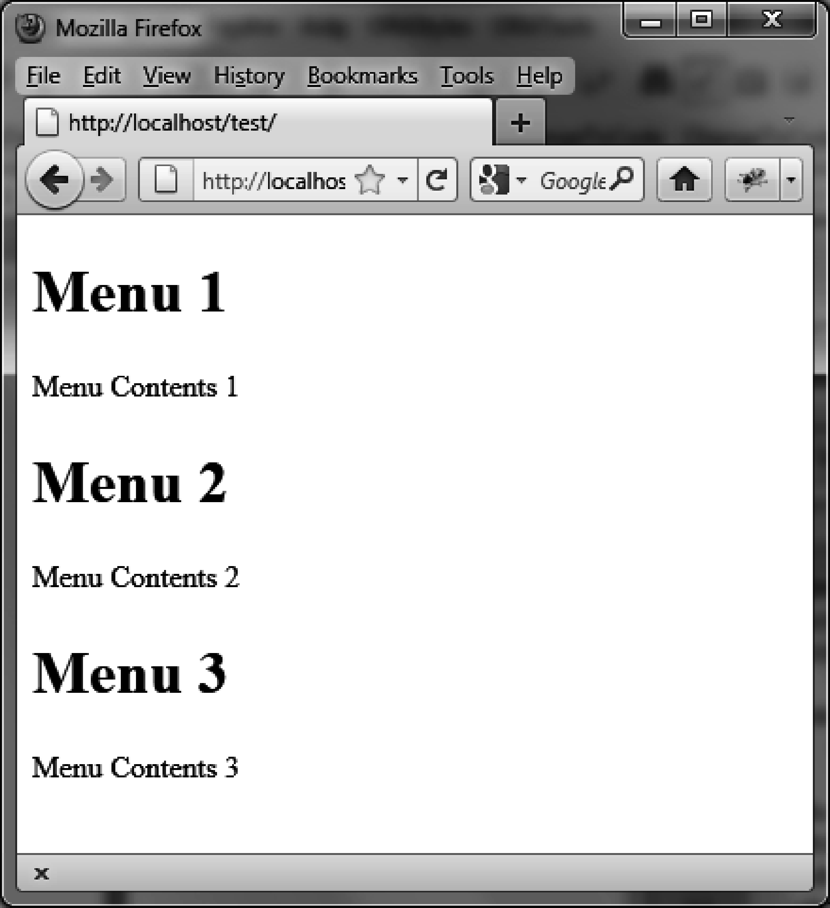

### 3.1　折叠菜单的基本用法

假设我们想要编写一段HTML代码来显示图3-1所示的折叠菜单。它有3个菜单栏，每一个里面的内容都是不一样的。


<center class="my_markdown"><b class="my_markdown">图3-1　折叠菜单</b></center>

按照jQuery UI的要求，需要挨个（标题和内容元素挨个重复）为每一个菜单编写以下内容：

+ 一个包含整个折叠菜单的 `<div>` 元素；
+ 一个作为菜单标题的元素，可以是<h1>、<h2>、…、<h6>，它包含了一个 `<a>` 链接，是菜单的名称（该链接不需要 `href` 属性，因为没用到）；
+ 一个作为菜单内容的 `<div>` 元素。

```css
<!DOCTYPE html>
<script src = jquery.js></script>
<script src = jqueryui/js/jquery-ui-1.8.16.custom.min.js></script>
<link rel=stylesheet type=text/css
　　　 href=jqueryui/css/smoothness/jquery-ui-1.8.16.custom.css />
<div id="accordion">
<h1><a>Menu 1</a></h1>
<div>Menu Contents 1</div>
<h1><a>Menu 2</a></h1>
<div>Menu Contents 2</div>
<h1><a>Menu 3</a></h1>
<div>Menu Contents 3</div>
</div>
<script>
</script>
```

在浏览器中显示这个页面，它只是一张包含了菜单标题和内容的简单HTML页面，结果又不是我们预期的（如图3-2所示）。


<center class="my_markdown"><b class="my_markdown">图3-2　简单折叠菜单的HTML预览页面</b></center>

正如在第2章中我们就知道的，要想得到预期的显示结果，在HTML页面中要按照jQuery UI的约定来做。为此，仅需调用jQuery UI的 `accordion ()` 方法来管理全局的 `<div>` 即可。在 `<script>` 标签中添加下面这行代码：

```css
<script>
$("#accordion").accordion ();
</script>
```

请注意HTML中的 `<! DOCTYPE html>` 语句。如果没有这条语句，则在IE浏览器中折叠菜单会被管理得很差劲。

