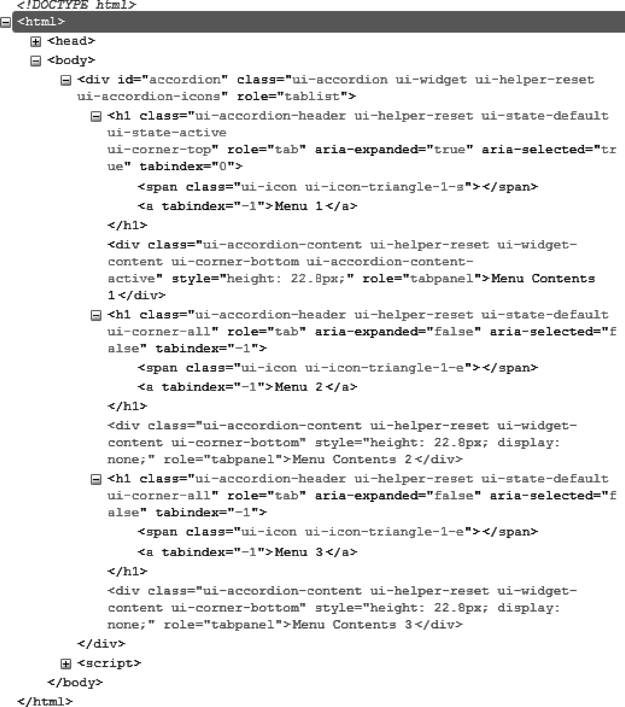
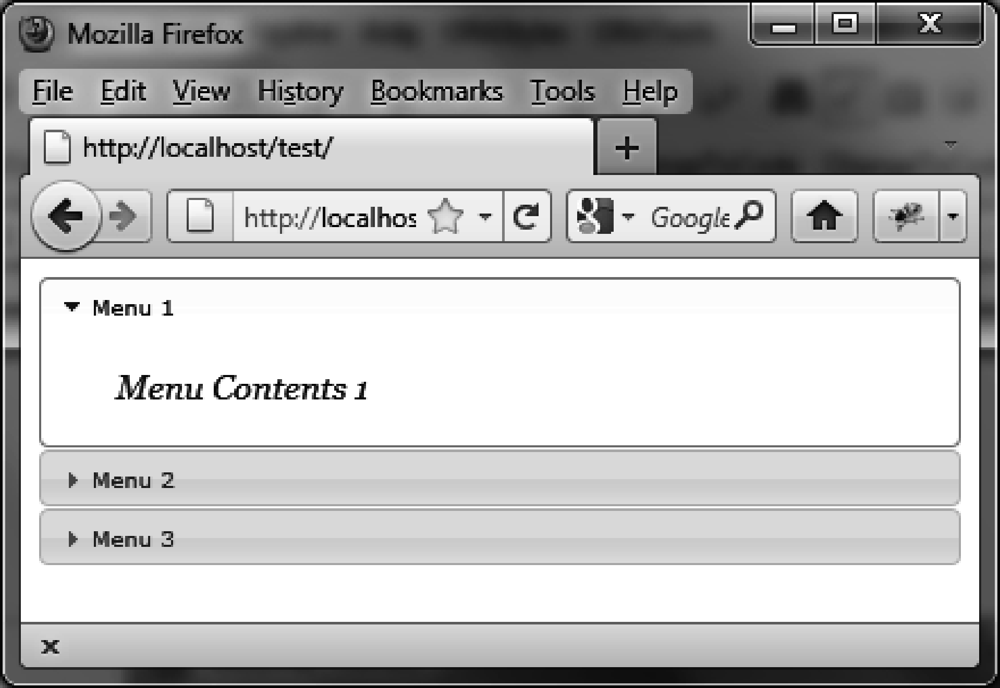

### 3.2　格式化内容

使用 `accordion ()` 方法会彻底改变已渲染页面中HTML元素的外观。实际上，该方法遍历了HTML代码并给相关的元素（这里是折叠菜单）增加了新的CSS类，赋予了它们适当的样式。

如图3.3所示，在 `accordion ()` 方法执行后，HTML代码已经改变了。该代码是用Firefox的Firebug扩展查看的。


<center class="my_markdown"><b class="my_markdown">图3-3　用 `accordion ()` 方法生成的HTML代码</b></center>

也可以修改元素的CSS类来自定义元素的显示样式。比如，如果修改了与 `<h1>` 元素关联的 `ui-accordion-header`  CSS类，将会得到新的菜单标题外观。同样地，如果修改了与 `<div>` 元素关联的 `ui-accordion-content`  CSS类，就会得到菜单内容的新外观了。

在HTML中添加一个 `<style>` 标签，来修改这些元素的样式（如粗体部分所示）：

```css
<!DOCTYPE html>
<script src = jquery.js></script>
<script src = jqueryui/js/jquery-ui-1.8.16.custom.min.js></script>
<link rel=stylesheet type=text/css
　　　 href=jqueryui/css/smoothness/jquery-ui-1.8.16.custom.css />
<style type=text/css>
　 h1.ui-accordion-header {
　　font-size : 10px; 
　 }
　 div.ui-accordion-content {
　　font-size : 15px; 
　　font-family : georgia; 
　　font-style : italic; 
　}
</style>
<div id="accordion">
　<h1><a>Menu 1</a></h1>
　<div>Menu Contents 1</div>
　<h1><a>Menu 2</a></h1>
　<div>Menu Contents 2</div>
　<h1><a>Menu 3</a></h1>
　<div>Menu Contents 3</div>
</div>
<script>
$("#accordion").accordion ();
</script>
```

我们在引入jQuery UI的样式之后添加了 `<style>` 标签，除此之外，这段HTML代码和前面的是一模一样的。必须在jQuery UI样式的后面添加自己的样式，否则更改是会被“忽略”的。

现在菜单及其内容呈现了新的自定义风格（如图3-4所示）。


<center class="my_markdown"><b class="my_markdown">图3-4　自定义的折叠菜单</b></center>

