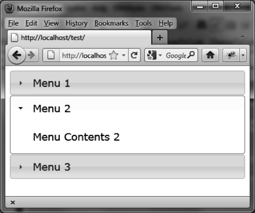

### 3.5.1　打开任意菜单

当创建折叠菜单时，默认第一个菜单（索引为0）是打开的。通过配置页面中的选项，换成打开第二个菜单（索引为1）。可以使用 `accordion ("activate")` 来完成：

```css
<!DOCTYPE html>
<script src = jquery.js></script>
<script src = jqueryui/js/jquery-ui-1.8.16.custom.min.js></script>
<link rel=stylesheet type=text/css
　　　 href=jqueryui/css/smoothness/jquery-ui-1.8.16.custom.css />
<div id="accordion">
　<h1><a>Menu 1</a></h1>
　<div>Menu Contents 1</div>
　<h1><a>Menu 2</a></h1>
　<div>Menu Contents 2</div>
　<h1><a>Menu 3</a></h1>
　<div>Menu Contents 3</div>
</div>
<script>
$("#accordion").accordion ().accordion ("activate", 1);
</script> 
```

第一个 `accordion ()` 方法创建了折叠菜单，是必需的。第二个 `accordion ()` 方法打开了索引为1的菜单。

当启动应用时第二个菜单是打开的，如图3-5所示。


<center class="my_markdown"><b class="my_markdown">图3-5　用 `"activate"` 操作打开第二个菜单</b></center>

