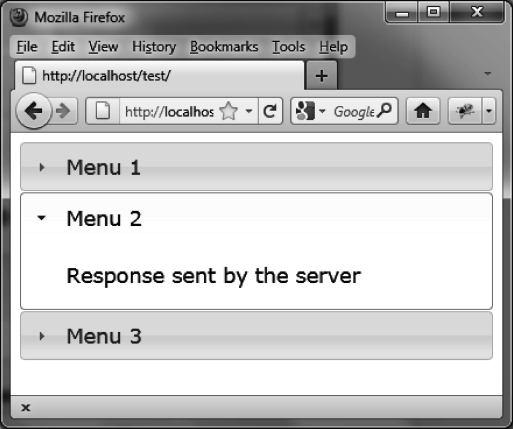

### 3.5.2　用Ajax加载菜单内容：使用 `options` 

让我们在打开菜单时，使用Ajax来改变菜单的内容。我们将使用 `options.change` 和 `options.`   `changestart` 方法。 `options.changestart` 方法将显示一个占位符（这个例子中是 `"Loading"` ）， `options.change` 方法发起Ajax请求：

```css
<!DOCTYPE html>
<script src = jquery.js></script>
<script src = jqueryui/js/jquery-ui-1.8.16.custom.min.js></script>
<link rel=stylesheet type=text/css
　　　 href=jqueryui/css/smoothness/jquery-ui-1.8.16.custom.css />
<div id="accordion">
　<h1><a>Menu 1</a></h1>
　<div>Menu Contents 1</div>
　<h1><a>Menu 2</a></h1>
　<div>Menu Contents 2</div>
　<h1><a>Menu 3</a></h1>
　<div>Menu Contents 3</div>
</div>
<script>
$("#accordion").accordion ({
　changestart : function (event, menus)
　{
　　menus.newContent.html ("Loading");
　},
　change : function (event, menus)
　{
　　menus.newContent.load ("action.php");
　}
});
</script>
```

`menu.newContent` 对象是打开菜单的jQuery类对象。action.php文件如下：

```css
<?
　$txt = "<span> Response sent by the server </span>";
　$txt = utf8_encode ($txt);
　echo ($txt);
?>
```

为了测试这个程序，我们必须使用以http://开头的URL（例如，<a class="my_markdown" href="['http://localhost']">http://localhost</a>），否则Ajax请求会报错。

在打开每个菜单的时候，首先出现“ `Loading` ”提示信息，当Ajax请求完成时提示信息消失，然后被替换成服务器返回的代码（如图3-6所示）。


<center class="my_markdown"><b class="my_markdown">图3-6　通过Ajax由服务器返回的代码</b></center>

也可以使用 `accordionchange` 和 `accordionchangestart` 事件来初始化菜单的内容。下一节会讨论它们。

