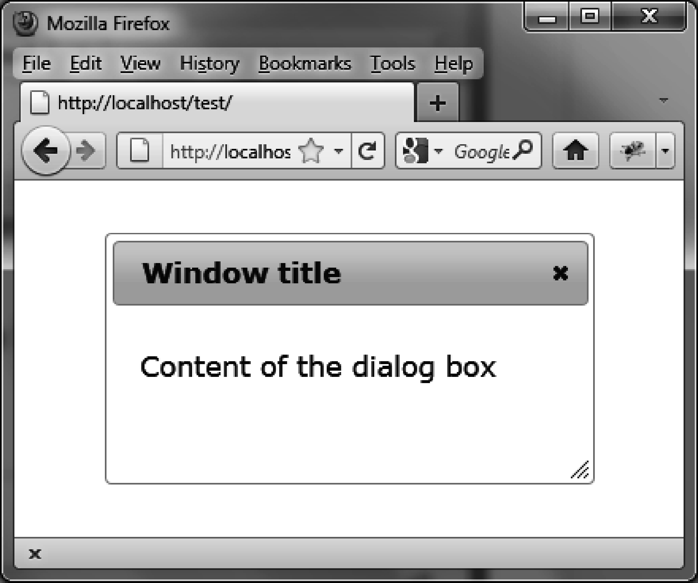
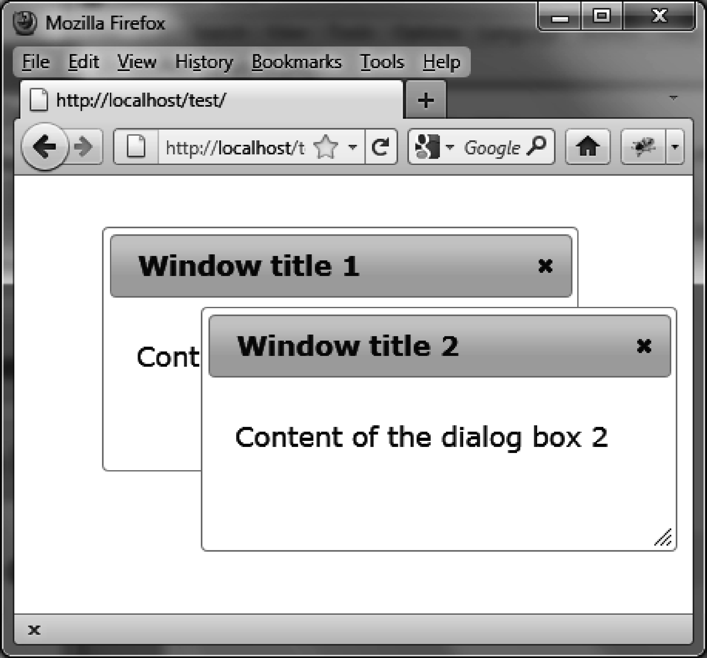

### 4.1　对话框的基本用法

假设我们想编写一段HTML代码来显示图4-1所示的对话框。


<center class="my_markdown"><b class="my_markdown">图4-1　HTML对话框</b></center>

这个对话框包含了一些文本内容以及一个带关闭按钮的标题栏。用户可以在页面上移动该对话框，并且可以调整它的大小。jQuery UI要求使用以下约定好的结构。

+ 一个包含整个对话框的 `<div>` 元素，它有一个 `title` 属性，会被当作对话框窗口的标题。
+ `<div>` 元素里面的内容会显示在对话框窗口中。

```css
<!DOCTYPE html>
<script src = jquery.js></script>
<script src = jqueryui/js/jquery-ui-1.8.16.custom.min.js></script>
<link rel=stylesheet type=text/css
　　　 href=jqueryui/css/smoothness/jquery-ui-1.8.16.custom.css />
<div id="dialog" title="Window title">
　<p> Content of the dialog box </p>
</div>
<script>
$("#dialog").dialog ();
</script>
```

`dialog ()` 方法把页面上的HTML代码转变成了显示对话框的HTML代码。

请注意HTML中的 `<! DOCTYPE html>` 语句。如果没有这条语句，在IE浏览器中对话框窗口会被管理得很差劲。

若要同时显示多个对话框，如同图4-2所示，需要包括以下内容（如粗体部分所示）：

```css
<!DOCTYPE html>
<script src = jquery.js></script>
<script src = jqueryui/js/jquery-ui-1.8.16.custom.min.js></script>
<link rel=stylesheet type=text/css
　　　 href=jqueryui/css/smoothness/jquery-ui-1.8.16.custom.css />
<div id="dialog1" title="Window title 1">
　<p> Content of the dialog box 1</p>
</div>
<div id="dialog2" title="Window title 2">
　<p> Content of the dialog box 2</p>
</div>
<script>
$("#dialog1, #dialog2").dialog ();
</script>
```


<center class="my_markdown"><b class="my_markdown">图4-2　同时显示多个对话框</b></center>

在由选择器选取的结果集元素（这个例子中是两个 `<div>` 元素）上调用 `dialog ()` 方法，会显示与每个元素相应的对话框。开始的时候，所有的对话框是叠加在一起的，用户在某个对话框上单击或拖动就能对其进行移动和定位。

