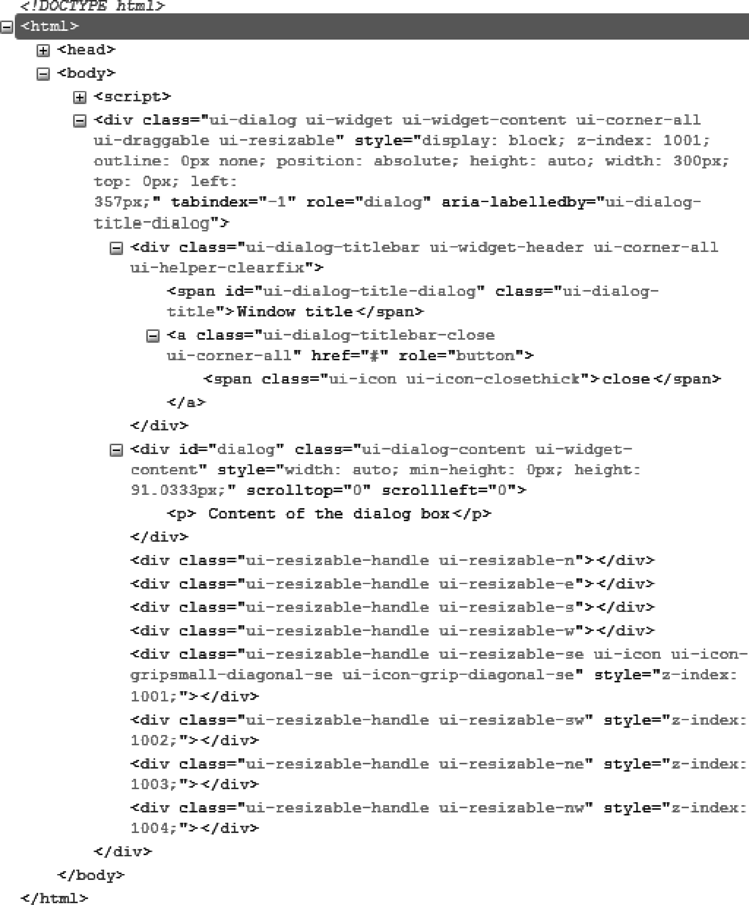
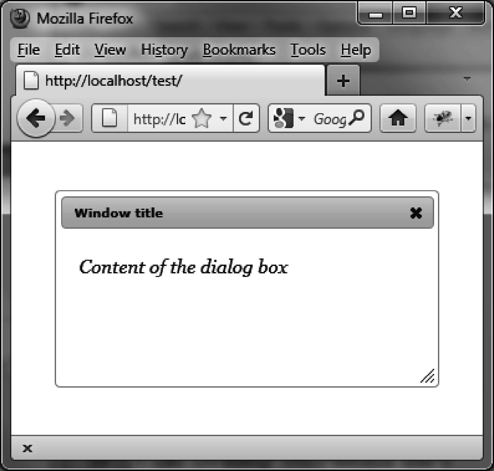

### 4.2　格式化内容

使用 `dialog ()` 方法会彻底改变已渲染页面中HTML元素的外观。实际上，该方法遍历了HTML代码并在相关的元素（这里是对话框）上增加了新的CSS类，赋予了它们适当的样式。

如图4-3所示，在 `dialog ()` 方法执行后，HTML代码已经改变了。该代码是用Firefox的Firebug扩展查看的。


<center class="my_markdown"><b class="my_markdown">图4-3　用 `dialog ()` 方法生成的HTML代码</b></center>

可以修改CSS类来自定义元素的显示样式。比如，如果修改了与 `<div>` 元素关联的 `ui-dialog-`   `titlebar`  CSS类，将会得到一个新的对话框窗口标题的外观。同样地，如果修改了与 `<div>` 元素关联的 `ui-dialog-content`  CSS类，就会得到对话框窗口内容的新外观了。

在HTML中添加一个 `<style>` 标签，来修改这些元素的样式（如粗体部分所示），从而获得如图4-4所示的显示效果：

```css
<!DOCTYPE html>
<script src = jquery.js></script>
<script src = jqueryui/js/jquery-ui-1.8.16.custom.min.js></script>
<link rel=stylesheet type=text/css
　　　 href=jqueryui/css/smoothness/jquery-ui-1.8.16.custom.css />
<style type=text/css>
　div.ui-dialog-titlebar {
　　font-size : 10px; 
　}
　div.ui-dialog-content {
　　font-size : 15px; 
　　font-family : georgia; 
　　font-style : italic; 
　}
</style>
<div id="dialog" title="Window title">
　<p> Content of the dialog box</p>
</div>
<script>
$("#dialog").dialog ();
</script>
```


<center class="my_markdown"><b class="my_markdown">图4-4　自定义的对话框</b></center>

我们在引入jQuery UI的样式之后添加了 `<style>` 标签，除此之外，这段HTML代码和前面的是一模一样的。必须在jQuery UI样式的后面添加自己的样式，否则更改是会被“忽略”的。

