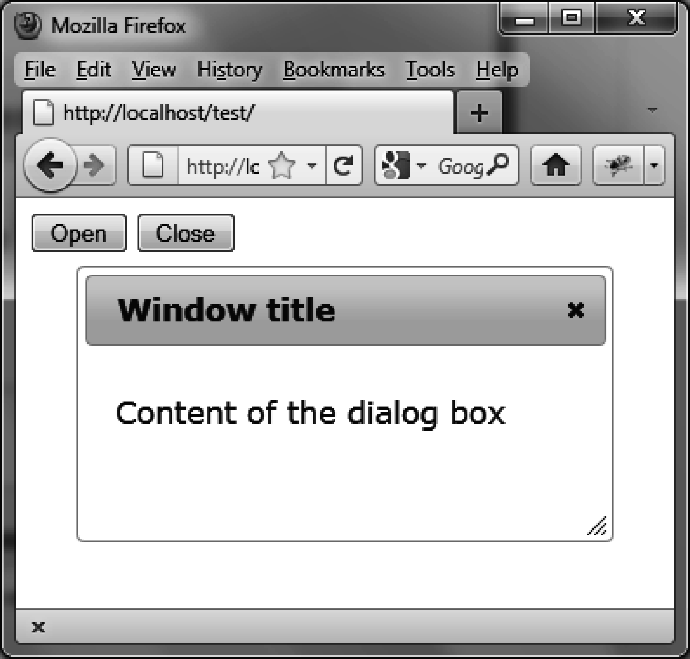
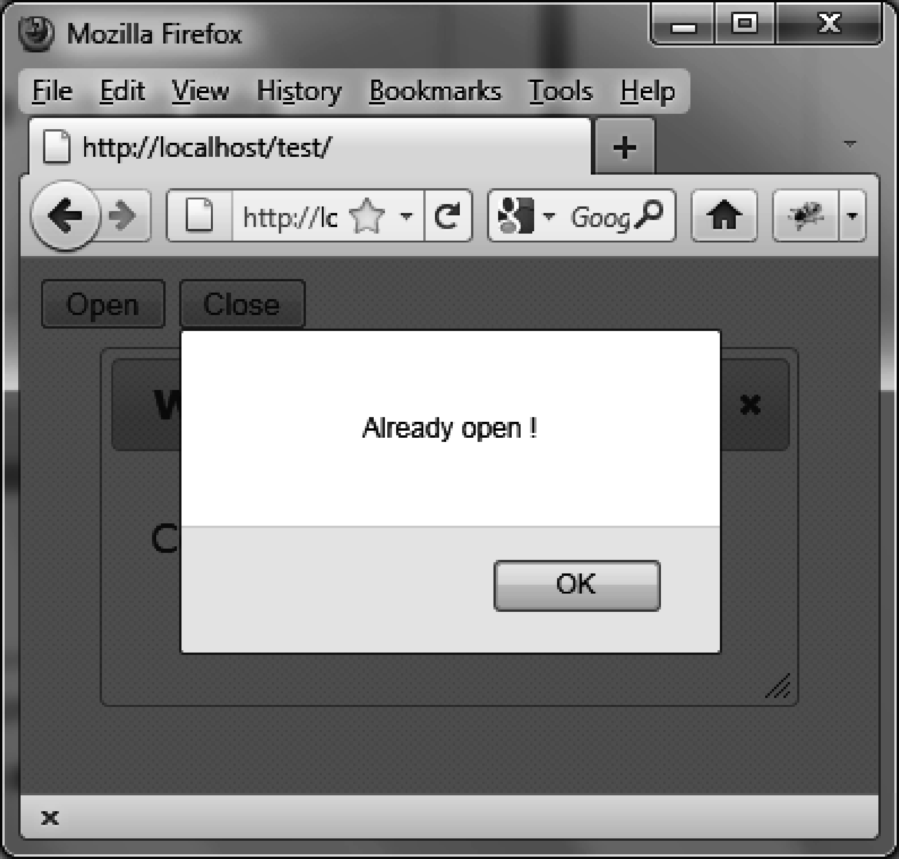

### 4.5.1　打开和关闭对话框

在下面的例子中，将使用 `dialog ("open")` 和 `dialog ("close")` 方法（如粗体部分所示），在页面中添加 `"Open"` 和 `"Close"` 两个按钮，用来打开和关闭对话框：

```css
<!DOCTYPE html>
<script src = jquery.js></script>
<script src = jqueryui/js/jquery-ui-1.8.16.custom.min.js></script>
<link rel=stylesheet type=text/css
　　　 href=jqueryui/css/smoothness/jquery-ui-1.8.16.custom.css />
<div id="dialog" title="Window title">
　<p> Content of the dialog box</p>
</div>
<input id=open type=button value=Open>
<input id=close type=button value=Close>
<script>
$("div#dialog").dialog ({
　autoOpen : false
});
$("#open").click (function (event) // Open 按钮处理
{
　if ($("#dialog").dialog ("isOpen")) alert ("Already open !"); 
　else $("#dialog").dialog ("open");
});
$("#close").click (function (event) // Close按钮处理
{
　if (!$("#dialog").dialog ("isOpen")) alert ("Already closed !"); 
　else $("#dialog").dialog ("close");
});
</script>
```

最初，创建了对话框但没打开它（ `options.autoOpen` 设置为 `false` ）。在打开对话框之前，用 `dialog ("isOpen")` 来检测它是否已经打开。关闭对话框时也一样进行检测。

图4-5显示了打开对话框后的窗口。


<center class="my_markdown"><b class="my_markdown">图4-5　打开和关闭对话框的按钮</b></center>

如果第二次尝试打开对话框，将会收到一条警告信息“Already open！”（如图 4-6所示）。


<center class="my_markdown"><b class="my_markdown">图4-6　尝试打开已经打开的对话框时显示的警告信息</b></center>

