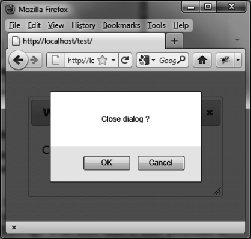

### 4.5.3　在关闭对话框时进行验证

可以使用 `options.beforeclose` 选项，在关闭对话框时进行验证。在关闭对话框时会调用该选项对应的方法。如果该方法返回 `false` ，则对话框不会关闭。

在下面这个例子中，当用户试着去关闭对话框时会出现一条确认消息（如图4-7所示）。当用户点了OK按钮时，将关闭对话框。

```css
<!DOCTYPE html>
<script src = jquery.js></script>
<script src = jqueryui/js/jquery-ui-1.8.16.custom.min.js></script>
<link rel=stylesheet type=text/css
　　　 href=jqueryui/css/smoothness/jquery-ui-1.8.16.custom.css />
<div id="dialog" title="Window title">
　<p> Content of the dialog box</p>
</div>
<script>
$("div#dialog").dialog ({
　beforeclose : function (event) 
　{
　　 if (!confirm ("Close dialog ?")) return false; 
　}
});
</script>
```


<center class="my_markdown"><b class="my_markdown">图4-7　在关闭对话框时进行验证的确认对话框</b></center>

另外一个阻止关闭对话框的方法是移除关闭按钮。下一节将讨论这个例子。

