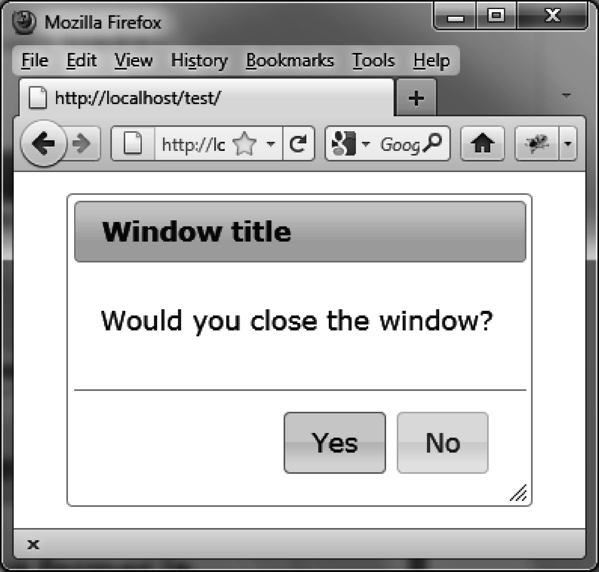

### 4.5.5　在对话框中插入按钮

现在我们想在对话框中插入按钮，像窗口中的Yes和No按钮，来询问用户：“Would you close the Window?”（见图4-9）。可以使用 `options.buttons` （如粗体部分所示）来完成这件事。

用户只能通过单击Yes按钮来关闭窗口—因为标准的关闭按钮已经被移除了。

```css
<!DOCTYPE html>
<script src = jquery.js></script>
<script src = jqueryui/js/jquery-ui-1.8.16.custom.min.js></script>
<link rel=stylesheet type=text/css
　　　 href=jqueryui/css/smoothness/jquery-ui-1.8.16.custom.css />
<div id="dialog" title="Window title">
　<p> Would you like to close the dialog box?</p>
</div>
<script>
$("div#dialog").dialog ({
　 buttons : {
　　 "Yes" : function ()
　　 {
　　　 $("div#dialog").dialog ("close");
　　 },
　　 "No" : function ()
　　 {
　　 }
　 }
}).prev ().find (".ui-dialog-titlebar-close").hide ();
</script>
```


<center class="my_markdown"><b class="my_markdown">图4-9　在对话框中显示的Yes和No按钮</b></center>

