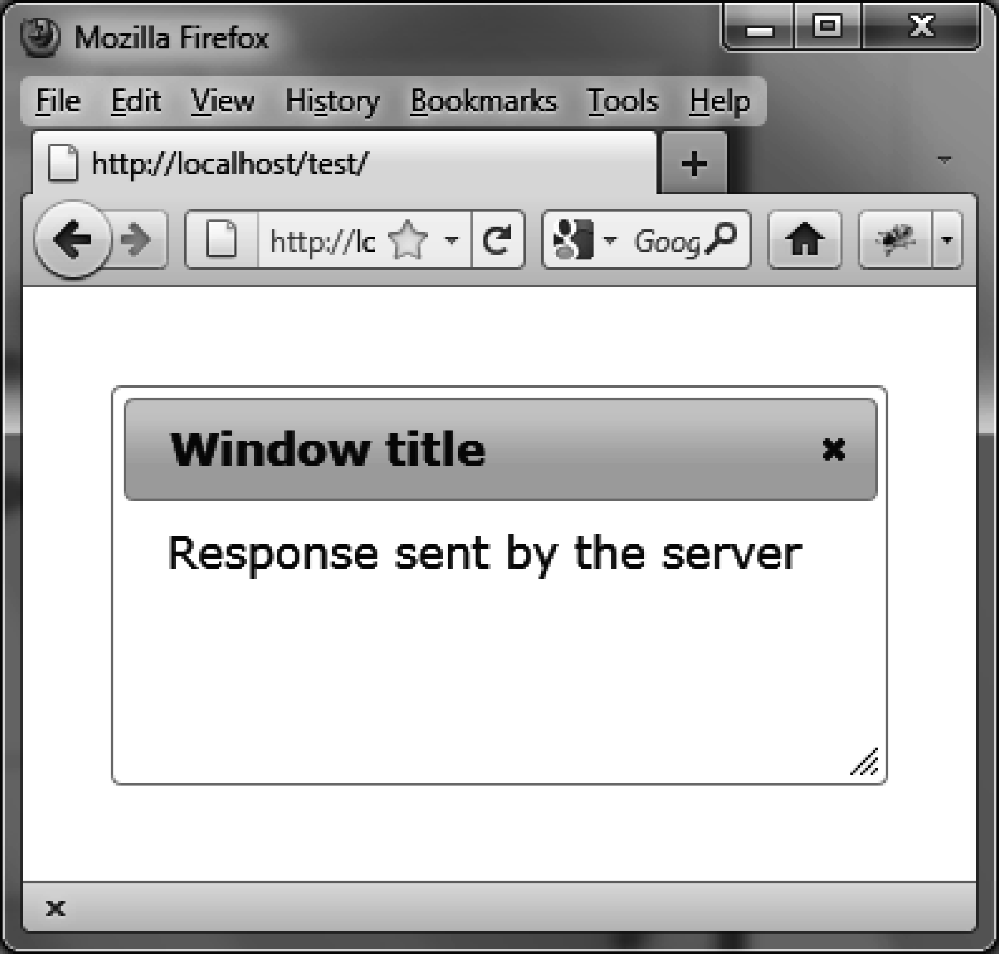

### 4.5.6　使用Ajax插入内容

现在让我们在对话框打开之前插入动态从服务器获取的内容。可以使用 `options.open` （粗体部分所示）方法来完成。在对话框显示之前会调用这个方法。

```css
<!DOCTYPE html>
<script src = jquery.js></script>
<script src = jqueryui/js/jquery-ui-1.8.16.custom.min.js></script>
<link rel=stylesheet type=text/css
　　　 href=jqueryui/css/smoothness/jquery-ui-1.8.16.custom.css />
<div id="dialog" title="Window title">
　 <p> Content of the dialog box</p>
</div>
<script>
$("div#dialog").dialog ({
　 open : function (event) 
　 {
　　 $(this).load ("action.php");
　 }
});
</script>
```

请回想一下，事件方法中（这里由 `options.open` 定义）的 `this` 值代表了对应对话框内容的HTML元素。 `$(this)` 则是DOM中这个元素对应的jQuery类对象。action.php文件如下：

```css
<?
　$txt = "<span> Response sent by the server </span>";
　$txt = utf8_encode ($txt);
　echo ($txt);
?>
```

在浏览器中显示的页面URL必须以http://开头，否则不会发起Ajax请求。

对话框的内容是用Ajax获取的，窗口显示了新的内容（如图4-10所示）。


<center class="my_markdown"><b class="my_markdown">图4-10　动态初始化的对话框</b></center>

