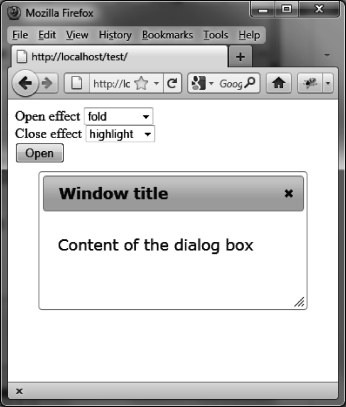

### 4.5.7　使用特效来更改对话框的行为

我们已经知道，创建对话框时使用的选项在对话框创建之后可以用 `dialog ("option",`   `param,`   `value)` 方法来修改它的值。 `param` 参数是选项的名称， `value` 是新的值。

为了说明这一点，我们来改变打开和关闭对话框窗口时的特效。显示两个下拉列表，在那可以选择想要的特效（ `"puff"` 、 `"slide"` 等）。当创建对话框时，没有特效与之关联：

```css
<!DOCTYPE html>
<script src = jquery.js></script>
<script src = jqueryui/js/jquery-ui-1.8.16.custom.min.js></script>
<link rel=stylesheet type=text/css
　　　 href=jqueryui/css/smoothness/jquery-ui-1.8.16.custom.css />
<div id="dialog" title="Window title">
　<p> Content of the dialog box</p>
</div>
Open effect
<select id=effectopen>
　 <option>No effect</option>
　 <option>blind</option>
　 <option>bounce</option>
　 <option>clip</option>
　 <option>drop</option>
　 <option>fold</option>
　 <option>highlight</option>
　 <option>puff</option>
　 <option>pulsate</option>
　 <option>scale</option>
　 <option>slide</option>
</select>
<br />
Close effect
<select id=effectclose>
　 <option>No effect</option>
　 <option>blind</option>
　 <option>bounce</option>
　 <option>clip</option>
　 <option>drop</option>
　 <option>fold</option>
　 <option>highlight</option>
　 <option>puff</option>
　 <option>pulsate</option>
　 <option>scale</option>
　 <option>slide</option>
</select>
<br />
<input id=open type=button value=Open>
<script>
$("div#dialog").dialog ({
　 autoOpen : false
});
$("#effectopen").change (function (event)
{
　 var effect = $(this).val ();
　 if (effect == "No effect") effect = false;
　 $("div#dialog").dialog ("option", "show", effect); 
});
$("#effectclose").change (function (event)
{
　 var effect = $(this).val ();
　 if (effect == "No effect") effect = false;
　 $("div#dialog").dialog ("option", "hide", effect); 
});
$("#open").click (function (event)
{
　 $("#dialog").dialog ("open");
});
</script>
```

图4-11展示了选取 `fold` 和 `highlight` 特效的结果。


<center class="my_markdown"><b class="my_markdown">图4-11　在打开和关闭对话框时应用特效</b></center>


