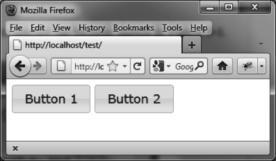

### 5.1　按钮的基本用法

假设我们想编写一段HTML代码来显示如图5-1所示的按钮。


<center class="my_markdown"><b class="my_markdown">图5-1　HTML页面中的按钮</b></center>

页面中有两个不同于普通外观的按钮。为了看到这种效果，可以使用包含按钮文字的 `<span>` 元素，也可以用别的HTML元素来替代 `<span>` 元素，比如 `<div>` 或者 `<button>` ，但是按钮的布局会是不一样的。例如，用 `<div>` 时，一个按钮会在另一个的上方。<a class="my_markdown" href="['#anchor51']"><sup class="my_markdown">①</sup></a>

```css
<!DOCTYPE html>
<script src = jquery.js></script>
<script src = jqueryui/js/jquery-ui-1.8.16.custom.min.js></script>
<link rel=stylesheet type=text/css
　　　 href=jqueryui/css/smoothness/jquery-ui-1.8.16.custom.css />
<span id="button1"> Button 1 </span>
<span id="button2"> Button 2 </span>
<script>
$("#button1, #button2").button ();
</script>
```

`button ()` 方法把HTML元素转变成了按钮，自动添加了鼠标移至按钮上的效果，这一切都是jQuery UI在背后“透明”地在管理的。

为了增强在IE浏览器中的显示效果，请务必加上 `<!DOCTYPE html>` 语句。

