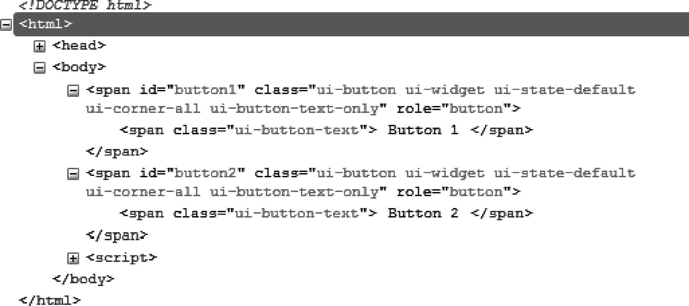
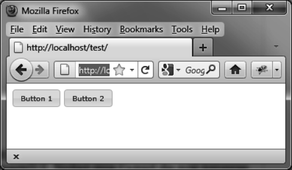

### 5.2　格式化内容

如图5-2所示，在 `button ()` 方法执行后，HTML代码已经改变了。该代码是用Firefox的Firebug扩展查看的。


<center class="my_markdown"><b class="my_markdown">图5-2　 `button ()` 方法生成的HTML代码</b></center>

和jQuery UI其他的功能一样，可以使用CSS类来自定义元素的样式。比如，如果更改了和 `<span>` 元素关联的 `ui-button`  CSS类，就会能得到一个新的按钮外观了（如图5-3所示）。


<center class="my_markdown"><b class="my_markdown">图5-3　自定义按钮</b></center>

在HTML中添加一个 `<style>` 标签，来修改这些元素的样式（如粗体部分所示）：

```css
<!DOCTYPE html>
<script src = jquery.js></script>
<script src = jqueryui/js/jquery-ui-1.8.16.custom.min.js></script>
<link rel=stylesheet type=text/css
　　　 href=jqueryui/css/smoothness/jquery-ui-1.8.16.custom.css />
<style type=text/css>
　span.ui-button {
　　font-size : 10px; 
　}
</style>
<span id="button1"> Button 1 </span>
<span id="button2"> Button 2 </span>
<script>
$("#button1, #button2").button ();
</script>
```

我们在引入jQuery UI的样式之后添加了 `<style>` 标签，除此之外，这段HTML代码和前面的是一模一样的。必须在jQuery UI样式的后面添加自己的样式，否则更改是会被“忽略”的。

