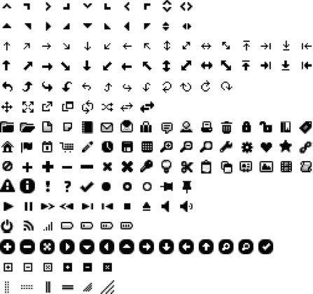

### 5.3.1　 `button (options)` 方法

`button (options)` 方法声明使用按钮机制来管理HTML元素。 `options` 参数是一个对象，用来指定按钮的外观及行为。

按钮可以使用文本来表现，但也可以使用每个主题下的jQuery UI CSS文件（这里指的是jquery. ui.theme.css文件）中预先定义好的图标。该文件包含一组CSS类，用来使用位于jqueryui/ development-bundle/themes/smoothness/images目录（对于smoothness主题而言）下的图标。在该CSS文件中，你可以看到CSS类的定义，比如下面的内容：

```css
和图片文件中的图标关联的CSS类定义
.ui-icon-calendar { background-position: −32px −112px; }
```

比如，要在按钮上使用日历图标，就可以在该按钮上面使用 `ui-icon-calendar` 类。

在jQuery UI中可以使用的图标如图5-4所示。


<center class="my_markdown"><b class="my_markdown">图5-4　jQuery UI中可以使用的图标</b></center>

表5-1描述了管理按钮的选项。

<center class="my_markdown"><b class="my_markdown">表5-1　管理按钮的选项</b></center>

| 选项 | 功能 |
| :-----  | :-----  | :-----  | :-----  |
| `options.disabled` | 当设置为 `true` 时，按钮是非激活的。鼠标移至按钮上没有效果，但在按钮上单击仍然是有效果的<a class="my_markdown" href="['#anchor52']"><sup class="my_markdown">②</sup></a> |
| `options.label` | 对应按钮上显示的文字。如果没有指定，HTML元素的内容将被用作按钮的文字 |
| `options.icons` | 对应按钮上的图标。在按钮文字的前面（主图标）及后面（次图标）可能都有一个图标。主图标对应的 `primary` 属性值和次图标对应的 `secondary` 属性值是在CSS文件中定义好的CSS类的名字（比如， `"ui-icon-calendar"` ） |
| `Options.text` | 指定是否显示按钮文字。当设置为 `false` 时，不会显示文字。此时，至少要显示一个图标 |

