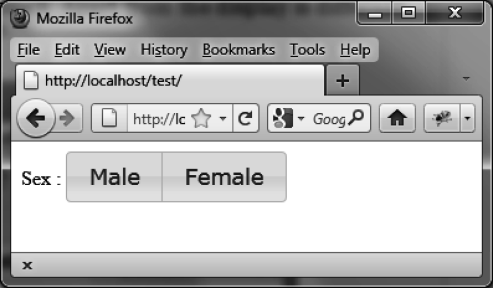

### 5.5.2　使用 `buttonset ()` 方法改进显示

图5-5和图5-6显示的单选按钮当然比传统的单选按钮更加赏心悦目，但如果能将他们编成一组形成一个整体那就更好了。稍微更改一下HTML代码就能做到，更改部分如粗体部分所示：

```css
<!DOCTYPE html>
<script src = jquery.js></script>
<script src = jqueryui/js/jquery-ui-1.8.16.custom.min.js></script>
<link rel=stylesheet type=text/css
　　　 href=jqueryui/css/smoothness/jquery-ui-1.8.16.custom.css />
<div>
Sex : <input type=radio name=sex id=m><label for=m>Male</label></input>
　　　 <input type=radio name=sex id=f><label for=f>Female</label></input>
</div>
<script>
$("input").button ();
$("div").buttonset ();③
</script>
```

和之前的代码不同的是，这里使用了一个 `<div>` 元素将 `<input>` 包了起来，然后在 `<div>` 元素上调用jQuery UI的 `buttonset ()` 方法，使按钮看起来像是一个整体。按钮的显示是不同了，但行为仍然是一样的。

该脚本的结果如图5-7所示。


<center class="my_markdown"><b class="my_markdown">图5-7　单选按钮形成一个整体</b></center>

