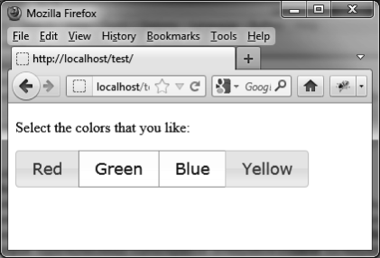

### 5.6.2　使用 `buttonset ()` 方法改进显示

可以把复选框组合成一个整体从而改进显示效果：

```css
<!DOCTYPE html>
<script src = jquery.js></script>
<script src = jqueryui/js/jquery-ui-1.8.16.custom.min.js></script>
<link rel=stylesheet type=text/css
　　　 href=jqueryui/css/smoothness/jquery-ui-1.8.16.custom.css />
<p>Select the colors that you like:</p>
<div>
　 <input type=checkbox name=red id=idred><label for=idred>Red</label></input>
　 <input type=checkbox name=green id=idgreen><label for=idgreen>Green</label></input>
　 <input type=checkbox name=blue id=idblue><label for=idblue>Blue</label></input>
　 <input type=checkbox name=yellow id=idyellow><label for=idyellow>Yellow</label></input>
</div>
<script>
$("input").button ();
$("div").buttonset ();
</script>
```

我们注意到这和单选按钮的用法是一样的。这是因为jQuery UI会根据 `<input>` 元素的不同 `type` 属性值来分别管理按钮。显示是不同的，但行为是一样的（如图5-9所示）。


<center class="my_markdown"><b class="my_markdown">图5-9　显示成一个整体的复选框</b></center>

