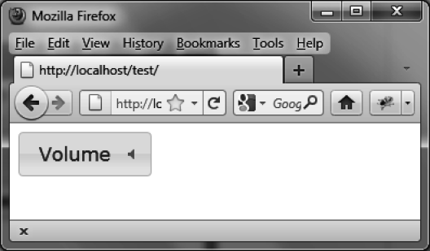
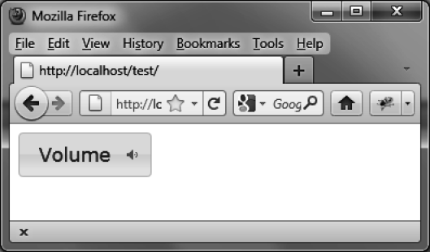
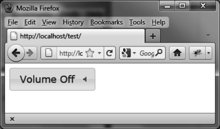
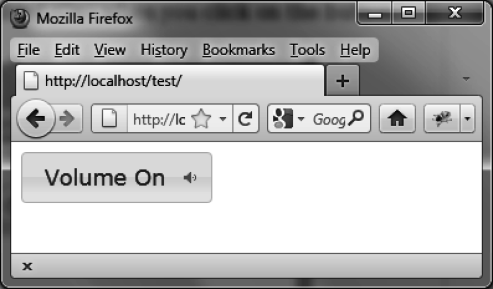

### 5.7.1　在按钮上显示图标

`options.icons` 选项定义了按钮的图标。例如，定义一个有音量图标的音量按钮，如图5-10所示，基本代码如下（如粗体部分所示）：

```css
<!DOCTYPE html>
<script src = jquery.js></script>
<script src = jqueryui/js/jquery-ui-1.8.16.custom.min.js></script>
<link rel=stylesheet type=text/css
　　　 href=jqueryui/css/smoothness/jquery-ui-1.8.16.custom.css />
<span id=volume>Volume</span>
<script>
$("#volume").button ({
　 icons : { secondary : "ui-icon-volume-off" }
});
</script>
```

图标插在了文字的后面（ `secondary` 属性）。 `"ui-icon-volume-off"` 是jQuery UI用于显示音量图标的CSS样式值（如图5-10所示）。


<center class="my_markdown"><b class="my_markdown">图5-10　插入在按钮文字后面的图标</b></center>

当单击按钮时，可以更改按钮的外观，从视觉上表现出按钮是打开的还是关闭的。例如，在图5-11中，我们看到了表示音量打开的图标：

```css
<!DOCTYPE html>
<script src = jquery.js></script>
<script src = jqueryui/js/jquery-ui-1.8.16.custom.min.js></script>
<link rel=stylesheet type=text/css
　　　 href=jqueryui/css/smoothness/jquery-ui-1.8.16.custom.css />
<span id=volume>Volume</span>
<script>
$("#volume").button ({
　 icons : { secondary : "ui-icon-volume-off" }
}).click (function (event)
{
　 // 当前音量状态
　 var volume = $(this).button("option", "icons").secondary ==
　　　　　　　　　　　　"ui-icon-volume-off" ? false : true;
　 // 反转音量状态（打开/关闭）
　 if (volume) $(this).button ("option", "icons",
　　　　　　　　　　　　　　　　　 { secondary : "ui-icon-volume-off" });
　 else $(this).button ("option", "icons", { secondary : "ui-icon-volume-on" });
});
</script>
```


<center class="my_markdown"><b class="my_markdown">图5-11　表示音量打开的图标</b></center>

除了更改图标外，还可以更改按钮的文字，显示Volume On或者Volume Off。

```css
<!DOCTYPE html>
<script src = jquery.js></script>
<script src = jqueryui/js/jquery-ui-1.8.16.custom.min.js></script>
<link rel=stylesheet type=text/css
　　　 href=jqueryui/css/smoothness/jquery-ui-1.8.16.custom.css />
<span id=volume>Volume Off</span>
<script>
$("#volume").button ({
　 icons : { secondary : "ui-icon-volume-off" }
}).click (function (event)
{
　 // 当前音量状态
　 var volume = $ (this).button ("option", "icons").secondary ==
　　　　　　　　　　　　"ui-icon-volume-off" ? false : true;
　 // 翻转音量状态（打开/关闭）
　 if(volume)
　 {
　　　// 文字
　　　$(this).button ("option", "label", "Volume Off");
　　　// 图标
　　　$ (this).button ("option", "icons", { secondary : "ui-icon-volume-off" });
　 }
　 else
　 {
　　　// 文字
　　　$(this).button ("option", "label", "Volume On");
　　　// 图标
　　　$ (this).button ("option", "icons", { secondary : "ui-icon-volume-on" });
　 }
});
</script>
```

程序启动时，音量是关闭的（如图5-12所示），当用户单击按钮时，音量变成可用了（打开的）（如图5-13所示）。


<center class="my_markdown"><b class="my_markdown">图5-12　程序启动时按钮显示的文字（音量是关闭的）</b></center>


<center class="my_markdown"><b class="my_markdown">图5-13　单击后按钮显示的文字（音量打开了）</b></center>

