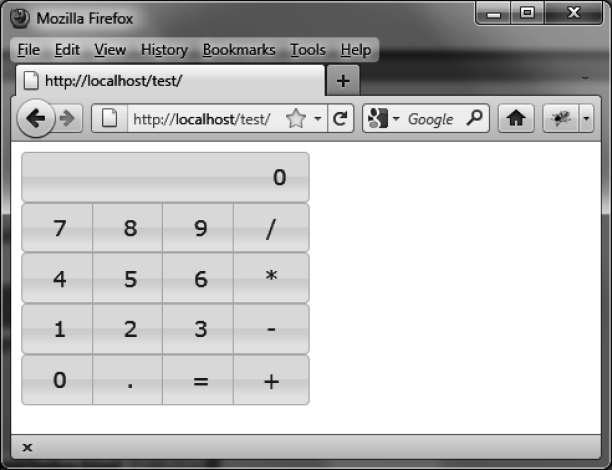
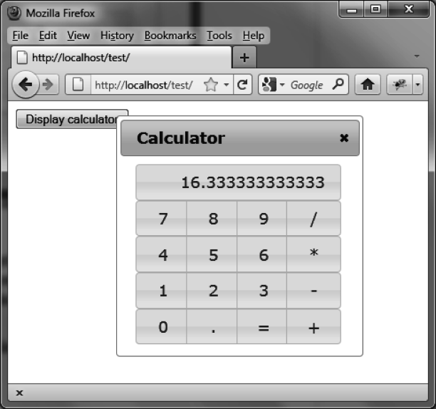

### 5.7.2　创建计算器

可以用按钮来创建图5-14所示的计算器。它可以执行基本的四则运算，用户单击显示结果的按钮（位于窗口最上方）时，可以重置显示。


<center class="my_markdown"><b class="my_markdown">图5-14　计算器</b></center>

#### 1．基本程序

使用下面的脚本来创建一个基本的计算器：

```css
<!DOCTYPE html>
<script src = jquery.js></script>
<script src = jqueryui/js/jquery-ui-1.8.16.custom.min.js></script>
<link rel=stylesheet type=text/css
　　　 href=jqueryui/css/smoothness/jquery-ui-1.8.16.custom.css />
<style type=text/css>
　span.ui-button-text-only { /* 任意按键 */
　　width : 60px;
　}
　div.ui-button-text-only { /* 结果域 */
　　width : 230px;
　　text-align : right;
　}
　div.ui-button-text-only.ie { /* IE特殊处理的结果域 */
　　width : 230px;
　}
</style>
<div id=result>0</div>
<div class=touches>
　 <span>7</span><span>8</span><span>9</span><span>/</span>
</div>
<div class=touches>
　 <span>4</span><span>5</span><span>6</span><span>*</span>
</div>
<div class=touches>
　 <span>1</span><span>2</span><span>3</span><span>-</span>
</div>
<div class=touches>
　 <span>0</span><span>.</span><span>=</span><span>+</span>
</div>
<script>
var result = 0;　　　　　　　　　// 计算结果
var previous_touche;　　　　　　// 之前按下的键
var last_operation;　　　 　　　// 上一次运算
$("span").button ().click (function (event)
{
　var touche = $(this).text ();　　　　　　// 当前按下的按钮
　var display = $("#result").text ();　 　// 当前的显示（字符串）
　if (touche == "+" || touche == "-" ||
　　 touche == "*" || touche == "/" ||
　　 touche == "=")
　{
　　 if(previous_touche != "+" && previous_touche != "-" &&
　　　　 previous_touche != "*" && previous_touche != "/")
　　 {
　　　　// 按下了 +、*、/ 或者 = ：
　　　　// 如果之前有运算还没完成，则执行计算得出结果
　　　　if (last_operation == "+")
　　　　{
　　　　　result += parseFloat (display);
　　　　　$("#result span").text(format_display (result));
　　　　}
　　　　else if (last_operation == "-")
　　　　{
　　　　　 result -= parseFloat (display);
　　　　　 $("#result span").text (format_display (result));
　　　　}
　　　　else if (last_operation == "*")
　　　　{
　　　　　 result *= parseFloat (display);
　　　　　 $("#result span").text (format_display (result));
　　　　}
　　　　else if (last_operation == "/")
　　　　{
　　　　　 result /= parseFloat (display);
　　　　　 $("#result span").text (format_display (result));
　　　　}
　　　　result = parseFloat ($("#result").text ());
　　　}
　　　if (touche == "=") last_operation = undefined;
　　　else last_operation = touche;
　 }
　 else
　 {
　　　// 按下数字键或者小数点
　　　// 将该键值与当前的显示结果组合,
　　　// 除非先前按下的按钮是运算符
　　　if (display == "0" ||
　　　　 previous_touche == "+" ||
　　　　 previous_touche == "-" ||
　　　　 previous_touche == "*" ||
　　　　 previous_touche == "/" ||
　　　　 previous_touche == "=") display = "";
　　　if (display.length < 16) display += touche;
　　　$("#result span").text (display);
　 }
　 previous_touche = touche;
});
$("div.touches").buttonset ();
$("div#result").button ().click (function (event)
{
　 // 单击结果域：把显示结果设置为0
　 var display = $("#result").text ();
　 if (display == "0") result = 0;
　 $("#result span").text ("0");
});
// IE浏览器添加特殊的样式
if ($.browser.msie) $("div#result").addClass ("ie");
// 确保显示的结果不会超过16个字符
function format_display (display)
{
　 display += "";
　 if (display.length < 16) return display;
　 if (display.match(/\./)) return display.substring (0, 15);
　 else return ("Out of Memory");
}
</script>
```

这个程序包括了按键的管理（比如，保留了被单击按钮的信息以及是否需要进行运算）。

为了说明IE浏览器和其他浏览器的显示差异，当jQuery UI检测到是IE浏览器时，会自动给结果显示域添加一个名为 `ie` 的CSS类。<a class="my_markdown" href="['#anchor54']"><sup class="my_markdown">④</sup></a>

这个计算器目前是运行在浏览器窗口中的。只需些许更改，就可以将这个计算器转变成一个能够脱离主浏览器窗口运行的应用。为此，可以创建一个jQuery插件。

#### 2．改进程序

我们创建的是计算器插件，并不是创建独立的计算器应用程序。计算器将以对话框形式展现，打开时显示在页面元素的上方（如图5-15所示）。把所有的计算器程序代码打包成一个可以被其他应用使用的第三方文件，这能简化程序的代码。


<center class="my_markdown"><b class="my_markdown">图5-15　以对话框形式打开的计算器</b></center>

下面的例子，主程序有一个Display calulator字样的按钮，当单击它时，会调用相应的插件。计算器显示在页面居中位置，并在其他元素的上方。用户可以单击对话框右上角的关闭按钮来关闭它。

下面的程序显示了使用计算器的按钮：

```css
<!DOCTYPE html>
<script src = jquery.js></script>
<script src = jqueryui/js/jquery-ui-1.8.16.custom.min.js></script>
<script src = jquery.calculator.js></script>
<link rel=stylesheet type=text/css
　　　 href=jqueryui/css/smoothness/jquery-ui-1.8.16.custom.css />
<link rel=stylesheet type=text/css href=jquery.calculator.css />
<button onclick=$.calculator ()>Display calculator </button>
```

这段简单的代码显示了一个按钮，按钮上的 `onclick` 事件处理是调用 `calculator ()` 插件。插件的功能由一个JavaScript文件jquery.calculator.js和一个CSS文件jquery.calculator.css组成，在HTML页面中引入这两个文件：

```css
span.ui-button-text-only { /* 任意按键 */
　width : 60px;
}
div.ui-button-text-only { /* 结果域 */
　width : 230px;
　text-align : right;
}
div.ui-button-text-only.ie { /* IE特殊处理的结果域 */
　width : 230px;
}
```

把CSS样式放到一个外部文件里面，在HTML文件中引入这个文件。

插件文件是 `jquery.calculator.js` ，内容如下：

```css
(function ($)
{
　$.calculator = function ()
　{
　　 var result = 0;　　　　　　// 计算结果
　　 var previous_touche;　　　// 之前按下的键
　　 var last_operation;　 　　// 上一次运算
　　 if ($("#calculator").length)
　　 {
　　　　// 计算器已经创建了，显示即可
　　　　$("#calculator").dialog ("open");
　　　　return;
　　 }
　　 // 创建计算器，只在第一次调用时执行
　　 var html = "<div id=calculator> \
　　　　　　　　　　　<div id=result>0</div> \
　　　　　　　　　　　<div class=touches> \
　　　　　　　　　　　　 <span>7</span><span>8</span><span>9</span><span>/</span>\
　　　　　　　　　　　</div> \
　　　　　　　　　　　<div class=touches> \
　　　　　　　　　　　　 <span>4</span><span>5</span><span>6</span><span>*</span>\
　　　　　　　　　　　</div> \
　　　　　　　　　　　<div class=touches> \
　　　　　　　　　　　　 <span>1</span><span>2</span><span>3</span><span>-</span>\
　　　　　　　　　　　</div> \
　　　　　　　　　　　<div class=touches> \
　　　　　　　　　　　　 <span>0</span><span>.</span><span>=</span><span>+</span>\
　　　　　　　　　　　</div> \
　　　　　　　　　　</div>"
　　　　　$(html).appendTo ("body");
　　　　　$("#calculator div.touches span").button ().click (function (event)
　　　　　{
　　　　　　 var touche = $(this).text ();　　　　　　　// 当前按下的按钮
　　　　　　 var display = $("#result").text ();　　　// 当前的显示（字符串）
　　　　　　 if (touche == "+" || touche == "-" ||
　　　　　　　　 touche == "*" || touche == "/" ||
　　　　　　　　 touche == "=")
　　　　　　 {
　　　　　　　　if (previous_touche != "+" && previous_touche != "-" &&
　　　　　　　　　 previous_touche != "*" && previous_touche != "/")
　　　　　　　　{
　　　　　　　　　// 按下了 +, -, *, / 或者 = ：
　　　　　　　　　// 如果之前有运算还没完成，则执行计算得出结果
　　　　　　　　　if (last_operation == "+")
　　　　　　　　　{
　　　　　　　　　　 result += parseFloat (display);
　　　　　　　　　　 $("#result span").text (format_display (result));
　　　　　　　　　}
　　　　　　　　　else if (last_operation == "-")
　　　　　　　　　{
　　　　　　　　　　result -= parseFloat (display);
　　　　　　　　　　$("#result span").text (format_display (result));
　　　　　　　　　}
　　　　　　　　　else if (last_operation == "*")
　　　　　　　　　{
　　　　　　　　　　result *= parseFloat (display);
　　　　　　　　　　$("#result span").text (format_display (result));
　　　　　　　　　}
　　　　　　　　　else if (last_operation == "/")
　　　　　　　　　{
　　　　　　　　　　result /= parseFloat (display);
　　　　　　　　　　$("#result span").text (format_display (result));
　　　　　　　　　}
　　　　　　　　　　result = parseFloat ($("#result").text ());
　　　　　　　　 }
　　　　　　 if (touche == "=") last_operation = undefined;
　　　　　　 else last_operation = touche;
　　　　　 }
　　　　　 else
　　　　　 {
　　　　　　 // 按下数字键或者小数点
　　　　　　 // 将该键值与当前的显示结果组合，
　　　　　　 // 除非先前按下的按钮是运算符
　　　　　　 if (display == "0" ||
　　　　　　　　 previous_touche == "+" ||
　　　　　　　　 previous_touche == "-" ||
　　　　　　　　 previous_touche == "*" ||
　　　　　　　　 previous_touche == "/" ||
　　　　　　　　 previous_touche == "=") display = "";
　　　　　　 if (display.length < 16) display += touche;
　　　　　　 $("#result span").text (display);
　　　　　}
　　　　　previous_touche = touche;
　　　 });
　　　 $("#calculator div.touches").buttonset ();
　　　 $("#calculator div#result").button ().click (function (event)
　　　 {
　　　　　// 单击结果域：把显示结果设置为0
　　　　　var display = $("#calculator #result").text ();
　　　　　if (display == "0") result = 0;
　　　　　$("#calculator #result span").text ("0");
　　　 });
　　　 // 为IE浏览器添加特殊的样式
　　　 if ($.browser.msie) $("#calculator div#result").addClass ("ie");
　　　 // 创建计算器的窗口
　　　 $("#calculator").dialog ({
　　　　　title : "Calculator",
　　　　　resizable : false,
　　　　　width : $.browser.msie ? 275 : 270
　　　 });
　　　 // 确保显示的结果不会超过16个字符
　　　 function format_display (display)
　　　 {
　　　　　display += "";
　　　　　if (display.length < 16) return display;
　　　　　if (display.match(/\./)) return display.substring (0, 15);
　　　　　else return ("Out of Memory");
　　　 }
　　}
})(jQuery);
```

除了JavaScript插件中创建计算器的HTML代码，这段程序和先前的几乎是一样的。此外，添加了一个包含计算器的对话框。

<a class="my_markdown" href="['#ac51']">①</a>　只有IE6和IE7浏览器才会出现这样的情况。——译者注

<a class="my_markdown" href="['#ac52']">②</a>　实际测试的结果表明单击按钮时并不会触发 `click` 事件。非激活状态下的按钮，标准的做法是不触发任何事件的。在jQuery UI的低版本中，设置 `disabled` 为 `true` 后，按钮还会触发 `click` 事件，这是一个bug，在本书使用的版本中已经修复该问题。——译者注

<a class="my_markdown" href="['#ac53']">③</a>　此时只需调用 `$("div").buttonset ()` 即可，并不需要调用 `$("input").button ()` 。——译者注

<a class="my_markdown" href="['#ac54']">④</a>　这里的 `ie`  CSS类并没有起到任何效果，因为宽度值 `width` 仍旧是 `230px` ，和 `div.ui-`   `button-text-only` 中的 `width` 是一样的。根据实际运行的结果，结果显示域在IE6、IE 7浏览器下有 `1px` 的偏差，故这里是作者的笔误，即应为 `231px` 。——译者注


