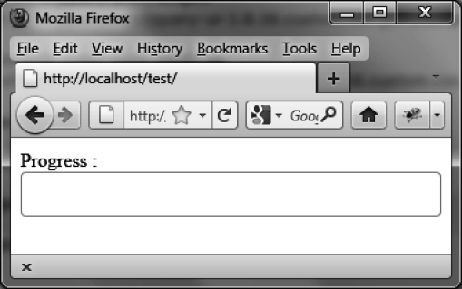

### 6.1　进度条的基本用法

假设我们想编写一段HTML代码来显示图6-1所示的进度条。这是一个会逐渐被填充的容器，用来指示任务的进度（此时它是空的，将会从左侧开始填充）。


<center class="my_markdown"><b class="my_markdown">图6-1　进度条</b></center>

jQuery UI要求使用 `<div>` 元素来表示进度条（如粗体部分所示）：

```css
<script src = jquery.js></script>
<script src = jqueryui/js/jquery-ui-1.8.16.custom.min.js></script>
<link rel=stylesheet type=text/css
　　　 href=jqueryui/css/smoothness/jquery-ui-1.8.16.custom.css />
Progress : <div id=progressbar></div>
<script>
$("div#progressbar").progressbar ();
</script>
```

上面的代码表示每一个用作进度条的 `<div>` 元素都由jQuery UI的 `progressbar ()` 方法来管理。

