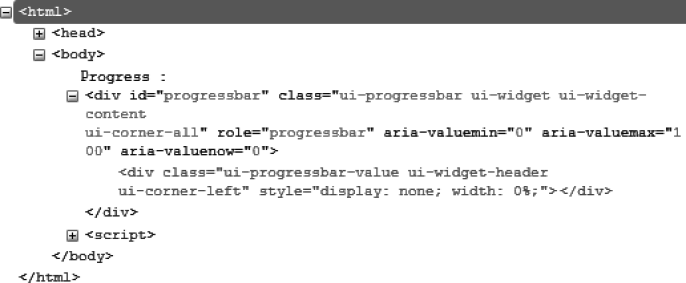
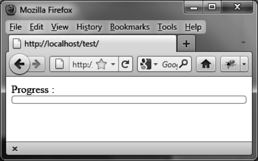

### 6.2　格式化内容

图6-2展示了在 `progressbar ()` 方法执行后由jQuery UI生成的HTML代码（该代码是用Firefox的Firebug扩展查看的）。


<center class="my_markdown"><b class="my_markdown">图6-2　 `progressbar ()` 方法生成的HTML代码</b></center>

和以前一样，可以使用CSS类来自定义元素的样式。比如，如果更改了和 `<div>` 元素关联的 `ui-progressbar`  CSS类，就会得到一个新的进度条外观了，像图6-3所示的那样，高度是10个像素：

```css
<script src = jquery.js></script>
<script src = jqueryui/js/jquery-ui-1.8.16.custom.min.js></script>
<link rel=stylesheet type=text/css
　　　 href=jqueryui/css/smoothness/jquery-ui-1.8.16.custom.css />
<style type=text/css>
　 div#progressbar.ui-progressbar {
　　 height : 10px; 
　 }
</style>
Progress : <div id=progressbar></div>
<script>
$("div#progressbar").progressbar ();
</script>
```


<center class="my_markdown"><b class="my_markdown">图6-3　自定义的进度条</b></center>

