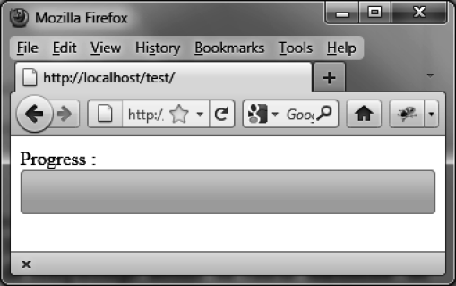

### 6.5.1　逐渐填充进度条

下面是一种典型的进度条应用。使用计数器（计时器）不断地增加进度条的填充百分比。

```css
<script src = jquery.js></script>
<script src = jqueryui/js/jquery-ui-1.8.16.custom.min.js></script>
<link rel=stylesheet type=text/css
　　　 href=jqueryui/css/smoothness/jquery-ui-1.8.16.custom.css />
Progress : <div id=progressbar></div>
<script>
$("div#progressbar").progressbar ();
var value = 0;
var timer = setInterval (function ()
{
　 $("div#progressbar").progressbar ("value", value); 
　 value++;
　 if (value > 100) clearInterval (timer); 
}, 10); 
</script>
```

`setInterval (callback, delay)` 中指定的回调函数，会在每个指定的时间周期（这里是每隔10 ms）被调用。 `clearInterval (timer)` 是防止该回调函数在填充百分比达到最大值100时仍被调用（如图6-4所示）。


<center class="my_markdown"><b class="my_markdown">图6-4　进度条被完全填充</b></center>

