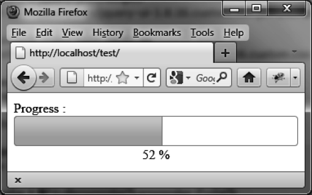

### 6.5.2　在完成过程中的不同阶段进行处理

除了逐渐填充进度条，还可以在填充完成过程中的特定阶段进行处理。在每次填充的百分比发生改变时，使用这个功能来更新显示完成填充百分比的数字（如图6-5所示）。这是通过使用 `options.change` 事件来完成的，它在进度条填充百分比值发生变化时会执行。

```css
<script src = jquery.js></script>
<script src = jqueryui/js/jquery-ui-1.8.16.custom.min.js></script>
<link rel=stylesheet type=text/css
　　　 href=jqueryui/css/smoothness/jquery-ui-1.8.16.custom.css />
Progress : <div id=progressbar></div>
<div id=percent style=text-align:center>0</div>
<script>
$("div#progressbar").progressbar ({
　 change : function (event) 
　 {
　　　var value = $("div#progressbar").progressbar ("value");
　　　$("#percent").html (value + " %");
　 }
});
var value = 0;
var timer = setInterval (function ()
{
　 $("div#progressbar").progressbar ("value", value);
　 value++;
　 if (value > 100) clearInterval (timer);
}, 10);
</script>
```


<center class="my_markdown"><b class="my_markdown">图6-5　以数字来显示填充完成的百分比</b></center>


