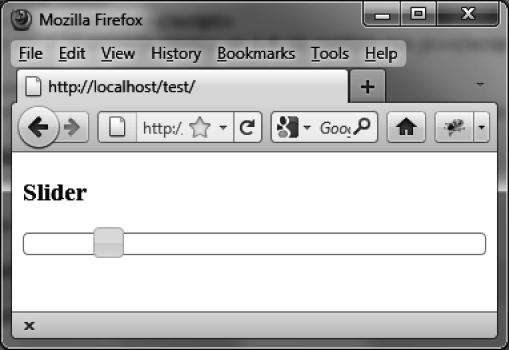

### 7.1　滑块的基本用法

我们编写一段HTML代码来显示图7-1所示的滑块，随后再调用jQuery UI的方法来管理这种图形组件：

```css
<!DOCTYPE html>
<script src = jquery.js></script>
<script src = jqueryui/js/jquery-ui-1.8.16.custom.min.js></script>
<link rel=stylesheet type=text/css
　　　 href=jqueryui/css/smoothness/jquery-ui-1.8.16.custom.css />
<h3>Slider</h3>
<div id=slider></div>
<script>
$("div#slider").slider ();
</script>
```

滑块（刻度轴和游标）用ID为 `slider` 的 `<div>` 元素来表示。

添加了一个 `<script>` 标签，指定每个和滑块对应的 `<div>` 元素由 `slider ()` 方法来管理。


<center class="my_markdown"><b class="my_markdown">图7-1　HTML页面中的滑块</b></center>

滑块的操作很简单：可以用鼠标拖动（拖放机制）游标或者是在滑块轴上的某一点上单击来移动游标。两种情况游标都会移动到指定的位置。

