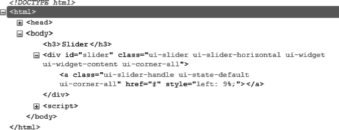
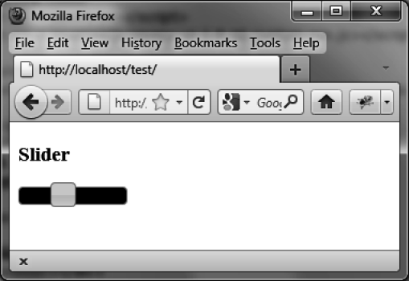

### 7.2　格式化内容

`slider ()` 方法的作用是改变页面中的HTML元素外观，添加新的CSS类，赋予了它们合适的样式。

图7-2展示了在 `slider ()` 方法执行后，由jQuery UI生成的HTML代码（该代码是用Firefox的Firebug扩展查看的）。


<center class="my_markdown"><b class="my_markdown">图7-2　 `slider ()` 方法生成的HTML代码</b></center>

可以使用CSS类来自定义元素的样式。比如，如果在HTML添加一个 `<style>` 标签，更改了和 `<div>` 元素关联的 `ui-slider`  CSS类，就可以更改滑块的宽度和背景色了，代码如下：

```css
<!DOCTYPE html>
<script src = jquery.js></script>
<script src = jqueryui/js/jquery-ui-1.8.16.custom.min.js></script>
<link rel=stylesheet type=text/css
　　　 href=jqueryui/css/smoothness/jquery-ui-1.8.16.custom.css />
<style type=text/css>
　div#slider.ui-slider {
　　width : 100px; 
　　background : black; 
　}
</style>
<h3>Slider</h3>
<div id=slider></div>
<script>
$("div#slider").slider ();
</script>
```

我们在引入jQuery UI的样式之后添加了 `<style>` 标签，除此之外，这段HTML代码和前面的是一模一样的。必须在jQuery UI样式的后面添加自己的样式，否则更改是会被“忽略”的。图7-3显示了新的样式。


<center class="my_markdown"><b class="my_markdown">图7-3　自定义的滑块</b></center>

此时，滑块的宽度为100个像素，背景色为黑色。

