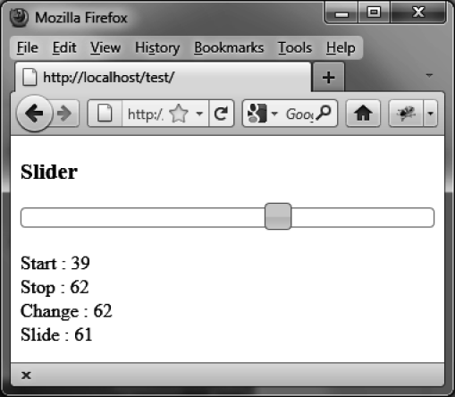

### 7.5.1　显示单个游标的值

从单个游标开始，在 `start` 、 `stop` 、 `slide` 及 `change` 事件发生时显示游标的值。

首先在每个事件发生时获得游标的值，然后在一个地方把该值显示出来。这就可以观察到jQuery UI是在何时触发每个事件的：

```css
<!DOCTYPE html>
<script src = jquery.js></script>
<script src = jqueryui/js/jquery-ui-1.8.16.custom.min.js></script>
<link rel=stylesheet type=text/css
　　　 href=jqueryui/css/smoothness/jquery-ui-1.8.16.custom.css />
<h3> Slider </h3>
<div id=slider></div><br />
Start : <span id=valuestart></span><br />
Stop : <span id=valuestop></span><br />
Change : <span id=valuechange></span><br />
Slide : <span id=valueslide></span>
<script>
$("div#slider").slider({
　animate : true,
　start : function(event) 
　{
　　var value = $("div#slider").slider("value");
　　$("#valuestart").html(value);
　},
　stop : function(event) 
　{
　　var value = $("div#slider").slider("value");
　　$("#valuestop").html(value);
　},
　change : function(event) 
　{
　　var value = $("div#slider").slider("value");
　　$("#valuechange").html(value);
　},
　slide : function(event) 
　{
　　var value = $("div#slider").slider("value");
　　$("#valueslide").html(value);
　}
});
</script>
```

脚本执行的结果如图7-4所示。


<center class="my_markdown"><b class="my_markdown">图7-4　显示滑块上单个游标的值</b></center>

这个例子只考虑了单个游标的情况，jQuery UI可以同时使用多个游标，下一节会讨论这种情况。

